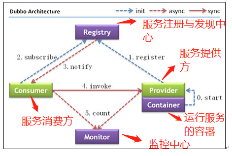
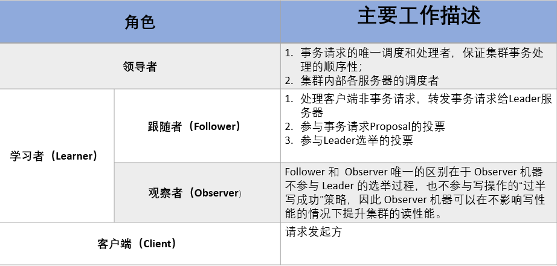
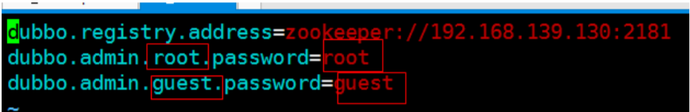

- [SOA](#soa)
- [RPC](#rpc)
- [分布式](#分布式)
- [Dubbo简介](#dubbo简介)
  - [Dubbo支持的注册中心](#Dubbo支持的注册中心)
  - [Dubbo支持的协议](#Dubbo支持的协议)
- [Zookeeper](#zookeeper)
- [Provider搭建](#provider搭建)
  - [dubbo-service](#dubboservice)
  - [dubbo-service-impl](#dubboserviceimpl)
- [Consumer搭建](#consumer搭建)
- [dubbo-admin管理界面](#dubboadmin管理界面)

## SOA

**面向服务架构**(Service Oriented Ambiguity)

有一个专门提供服务的单元，其他所有单元都调用这个服务。

**SOA定位**：如何设计项目,让开发时更有效率，SOA 是一种**思想**

使用 SOA 架构：专门访问数据库服务(项目)，开发时可以实现，数据访问控制和代码复用

**实现 SOA 架构时常用服务**：

- Dubbo 做为服务
- WebService 做为服务
- Dubbox 做为服务
- 服务方就是 web 项目,调用 web 项目的控制器；使用 HttpClient 可以调用其他项目的控制器。


## RPC

远程过程调用协议(Remote Procedure Call Protocol)

客户端通过互联网调用远程服务器，不知道远程服务器具体实现，只知道远程服务器提供了什么功能。

RPC 最大**优点**：数据安全性


## 分布式

分布式或者说 SOA 分布式重要的就是面向服务，说简单的分布式就是我们把整个系统拆分成不同的服务然后将这些服务放在不同的服务器上减轻单体服务的压力提高并发量和性能。比如电商系统可以简单地拆分成订单系统、商品系统、登录系统等等，拆分之后的每个服务可以部署在不同的机器上，如果某一个服务的访问量比较大的话也可以将这个服务同时部署在多台机器上。

**为什么要分布式**

从开发角度来讲单体应用的代码都集中在一起，而分布式系统的代码根据业务被拆分。所以，每个团队可以负责一个服务的开发，这样提升了开发效率。另外，代码根据业务拆分之后更加便于维护和扩展。

另外，我觉得将系统拆分成分布式之后不光便于系统扩展和维护，更能提高整个系统的性能。你想一想嘛？把整个系统拆分成不同的服务/系统，然后每个服务/系统 单独部署在一台服务器上，是不是很大程度上提高了系统性能呢？


## Dubbo简介

一个分布式、高性能、透明化的 RPC 服务框架。

**作用**：提供服务自动注册、自动发现等高效服务治理方案

**Dubbo架构图**：



- Provider：提供者，服务发布方

- Consumer：消费者，调用服务方

- Container：Dubbo容器，依赖于Spring 容器.

- Registry：注册中心。当 Container 启动时把所有可以提供的服务列表上 Registry 中进行注册。

  **作用**：告诉 Consumer 提供了什么服务和服务方在哪里.

- Monitor：监听器

**运行原理：**

- 启动容器，相当于在启动 Dubbo 的 Provider。

- 启动后会去注册中心进行注册，注册所有可以提供的服务列表。

- 在 Consumer 启动后会去 Registry 中获取服务列表和 Provider的地址，进行订阅。

- 当 Provider 有修改后，注册中心会把消息推送给 Consummer。

  使用了**观察者设计模式**(又叫发布/订阅设计模式)

- 根据获取到的 Provider 地址，真实调用 Provider 中功能。

  在 Consumer 方使用了**代理设计模式**，创建一个 Provider方类的一个代理对象。通过代理对象获取 Provider 中真实功能，起到保护 Provider 真实功能的作用。

- Consumer 和 Provider 每隔1分钟向 Monitor 发送统计信息，统计信息包含：访问次数、频率等。


### Dubbo支持的注册中心

- **Zookeeper**
  - 优点：支持网络集群
  - 缺点：稳定性受限于 Zookeeper
- **Redis**
  - 优点：性能高.
  - 缺点：对服务器环境要求较高
- **Multicast**
  - 优点：面中心化，不需要额外安装软件
  - 缺点：建议同机房(局域网)内使用
- **Simple**
  - 适用于测试环境，不支持集群


### Dubbo支持的协议

- **Dubbo**
  - Dubbo 官方推荐的协议
  - 本质：使用 NIO 和线程池进行处理
  - 缺点：大文件传输时可能出现文件传输失败问题.

- **RMI**
  - JDK 提供的协议,远程方法调用协议
  - 缺点：偶尔连接失败
  - 优点：JDK 原生，不需要进行额外配置(导入 jar)
- **Hession**
  - 优点：基于 http 协议，http 请求支持
  - 缺点：需要额外导入 jar，并在短连接时性能低


## Zookeeper

Zookeeper分布式协调组件，本质是一个Java语言编写的软件。

**Zookeeper常用功能**：

- 发布订阅功能，把 zookeeper 当作注册中心原因
- 分布式/集群管理功能

**使用：**

- ZooKeeper 作为 Dubbo 的注册中心
- 搭建 solr 集群的时候，使用 ZooKeeper 作为 solr 集群的管理工具

**ZooKeeper集群角色介绍**

**最典型集群模式： Master/Slave 模式（主备模式）**。在这种模式中，通常 Master服务器作为主服务器提供写服务，其他的 Slave 服务器从服务器通过异步复制的方式获取 Master 服务器最新的数据提供读服务。

**在 ZooKeeper 中没有选择传统的 Master/Slave 概念，而是引入了Leader、Follower 和 Observer 三种角色**。如下图所示


**ZooKeeper 集群中的所有机器通过一个 Leader 选举过程来选定一台称为 “Leader” 的机器，Leader 既可以为客户端提供写服务又能提供读服务。除了 Leader 外，Follower 和 Observer 都只能提供读服务。Follower 和 Observer 唯一的区别在于 Observer 机器不参与 Leader 的选举过程，也不参与写操作的“过半写成功”策略，因此 Observer 机器可以在不影响写性能的情况下提升集群的读性能。**



**当 Leader 服务器出现网络中断、崩溃退出与重启等异常情况时，ZAB 协议就会进人恢复模式并选举产生新的Leader服务器。**


## Provider搭建

### dubbo-service

里面只有接口，由于RPC 框架，不希望 Consumer 知道具体实现。如果实现类和接口在同一个项目中，Consumer 依赖这个项目时，就会知道实现类具体实现。

````java
public interface TbItemDubboService {
	/**
	 * 商品分页查询
	 * @param page 第几页
	 * @param rows 每页显示的数据数量
	 * @return
	 */
	EasyUIDataGrid show(int page,int rows);
	
	/**
	 * 根据id修改商品状态
	 * @param tbItem
	 * @return
	 */
	int updItemStatus(TbItem tbItem);
	
	/**
	 * 新增包含商品表和商品描述表及规格参数
	 * @param tbItem
	 * @param desc
	 * @return
	 */
	int insItemDesc(TbItem tbItem,TbItemDesc desc,TbItemParamItem paramItem) throws Exception;
	/**
	 * 通过状态查询全部可用数据
	 * @param status
	 * @return
	 */
	List<TbItem> selAllByStatus(byte status);
	/**
	 * 根据id查询商品信息
	 * @param id
	 * @return
	 */
	TbItem selById(long id);
}
````


### dubbo-service-impl

 **pom.xml**

````xml
<project xmlns="http://maven.apache.org/POM/4.0.0"
	xmlns:xsi="http://www.w3.org/2001/XMLSchema-instance"
	xsi:schemaLocation="http://maven.apache.org/POM/4.0.0 http://maven.apache.org/xsd/maven-4.0.0.xsd">
	<modelVersion>4.0.0</modelVersion>
	<parent>
		<groupId>com.ego</groupId>
		<artifactId>ego-parent</artifactId>
		<version>0.0.1-SNAPSHOT</version>
	</parent>
	<artifactId>ego-service-impl</artifactId>
	
	<dependencies>
        <!-- 分页插件 -->
		<dependency>
			<groupId>com.github.pagehelper</groupId>
			<artifactId>pagehelper</artifactId>
		</dependency>
        <!-- 依赖dubbo-service -->
		<dependency>
			<groupId>com.ego</groupId>
			<artifactId>ego-service</artifactId>
			<version>0.0.1-SNAPSHOT</version>
		</dependency>
		<!-- spring -->
		<dependency>
			<groupId>org.springframework</groupId>
			<artifactId>spring-webmvc</artifactId>
		</dependency>
		<dependency>
			<groupId>org.springframework</groupId>
			<artifactId>spring-jdbc</artifactId>
		</dependency>
		<dependency>
			<groupId>org.aspectj</groupId>
			<artifactId>aspectjweaver</artifactId>
		</dependency>
		<!-- mybatis -->
		<dependency>
			<groupId>org.mybatis</groupId>
			<artifactId>mybatis</artifactId>
		</dependency>
		<!-- mybatis和spring整合 -->
		<dependency>
			<groupId>org.mybatis</groupId>
			<artifactId>mybatis-spring</artifactId>
		</dependency>
		<!-- log4j 日志 -->
		<dependency>
			<groupId>log4j</groupId>
			<artifactId>log4j</artifactId>
		</dependency>
		<!-- mysql 驱动类 -->
		<dependency>
			<groupId>mysql</groupId>
			<artifactId>mysql-connector-java</artifactId>
		</dependency>
		<!-- dubbo -->
		<dependency>
			<groupId>com.alibaba</groupId>
			<artifactId>dubbo</artifactId>
			<exclusions>
				<exclusion>
					<artifactId>spring</artifactId>
					<groupId>org.springframework</groupId>
				</exclusion>
			</exclusions>
		</dependency>
		<!-- 访问zookeeper的客户端jar -->
		<dependency>
			<groupId>com.101tec</groupId>
			<artifactId>zkclient</artifactId>
		</dependency>
	</dependencies>
</project>
````

**接口的实现类**

````java
public class TbItemDubboServiceImpl implements TbItemDubboService {
	@Resource
	private TbItemMapper tbItemMapper;
	@Resource
	private TbItemDescMapper tbItemDescMapper;
	@Resource
	private TbItemParamItemMapper tbItemParamItemMapperImpl;
	/**
	 * 分页查询
	 */
	@Override
	public EasyUIDataGrid show(int page, int rows) {
		PageHelper.startPage(page, rows);
		//查询全部
		List<TbItem> list = tbItemMapper.selectByExample(new TbItemExample());
		
		//分页代码
		//设置分页条件
		
		PageInfo<TbItem> pi = new PageInfo<>(list);
		
		//放入到实体类
		EasyUIDataGrid datagrid = new EasyUIDataGrid();
		datagrid.setRows(pi.getList());
		datagrid.setTotal(pi.getTotal());
		
		return datagrid;
	}
	/**
	 * 修改商品状态
	 */
	@Override
	public int updItemStatus(TbItem tbItem) {
		return tbItemMapper.updateByPrimaryKeySelective(tbItem);
	}
	
	/**
	 * 新增商品、商品描述、规格参数，带事务功能
	 * 
	 * @throws Exception 
	 */
	@Override
	public int insItemDesc(TbItem tbItem, TbItemDesc desc,TbItemParamItem paramItem) throws Exception {
		int index = 0;
		try {
			index = tbItemMapper.insertSelective(tbItem);
			index += tbItemDescMapper.insertSelective(desc);
			index += tbItemParamItemMapperImpl.insertSelective(paramItem);
		} catch (Exception e) {
			e.printStackTrace();
		}
		if(index==3) {
			return 1;
		}else {
			throw new Exception("新增失败，数据还原");
		}
	}
	/**
	 * 通过状态查询全部可用数据
	 */
	@Override
	public List<TbItem> selAllByStatus(byte status) {
		TbItemExample example = new TbItemExample();
		example.createCriteria().andStatusEqualTo(status);		
		return tbItemMapper.selectByExample(example);
	}
	@Override
	public TbItem selById(long id) {
		return tbItemMapper.selectByPrimaryKey(id);
	}
}
````

**applicationContext-dubbo.xml**

该文件需要建在 resources/META-INF/spring 下

````xml
<?xml version="1.0" encoding="UTF-8"?>
<beans xmlns="http://www.springframework.org/schema/beans"
	xmlns:xsi="http://www.w3.org/2001/XMLSchema-instance"
	xmlns:context="http://www.springframework.org/schema/context"
	xmlns:dubbo="http://code.alibabatech.com/schema/dubbo"
	xsi:schemaLocation="http://www.springframework.org/schema/beans 
	http://www.springframework.org/schema/beans/spring-beans.xsd
	http://www.springframework.org/schema/context 
	http://www.springframework.org/schema/context/spring-context.xsd
	http://code.alibabatech.com/schema/dubbo 
	http://code.alibabatech.com/schema/dubbo/dubbo.xsd">

	<!-- 给当前 Provider 自定义个名字 -->
	<dubbo:application name="dubbo-ego-service" />
	<!-- 配置注册中心 address:注册中心的ip和端口；protocol 使用哪种注册中心 -->
	<dubbo:registry address="192.168.182.130:2181" protocol="zookeeper"></dubbo:registry>
	<!-- 配置协议  name：使用什么协议  port:consumer invoke provider时的端口号 -->
	<dubbo:protocol name="dubbo" port="20888"></dubbo:protocol>
	<!-- 注册功能 -->
	<dubbo:service interface="com.ego.dubbo.service.TbItemDubboService" ref="tbItemDubboServiceImpl"></dubbo:service>
	<bean id="tbItemDubboServiceImpl" class="com.ego.dubbo.service.impl.TbItemDubboServiceImpl"></bean>
````

**启动容器**

```java
public class Test {
	public static void main(String[] args) {
		Main.main(args);
	}
}
```


## Consumer搭建

在 **pom.xml** 中添加 dubbo 相关 3 个依赖(接口、dubbo.jar、zkClient)

````xml
<dependencies>
    <!-- 依赖接口 -->
    <dependency>
        <groupId>com.ego</groupId>
        <artifactId>ego-service</artifactId>
        <version>0.0.1-SNAPSHOT</version>
    </dependency>
    <!-- dubbo -->
    <dependency>
        <groupId>com.alibaba</groupId>
        <artifactId>dubbo</artifactId>
        <exclusions>
            <exclusion>
                <artifactId>spring</artifactId>
                <groupId>org.springframework</groupId>
            </exclusion>
        </exclusions>
    </dependency>
    <!-- 访问zookeeper的客户端jar -->
    <dependency>
        <groupId>com.101tec</groupId>
        <artifactId>zkclient</artifactId>
    </dependency>
</dependencies>
````

**web.xml** 中修改applicationContext-*.xml

```xml
<!-- 上下文参数 -->
<context-param>
    <param-name>contextConfigLocation</param-name>
    <param-value>classpath*:applicationContext-*.xml</param-value>
</context-param>
```

**applicationContext-dubbo.xml**

````xml
<?xml version="1.0" encoding="UTF-8"?>
<beans xmlns="http://www.springframework.org/schema/beans"
	xmlns:xsi="http://www.w3.org/2001/XMLSchema-instance"
	xmlns:context="http://www.springframework.org/schema/context"
	xmlns:dubbo="http://code.alibabatech.com/schema/dubbo"
	xsi:schemaLocation="http://www.springframework.org/schema/beans 
	http://www.springframework.org/schema/beans/spring-beans.xsd
	http://www.springframework.org/schema/context 
	http://www.springframework.org/schema/context/spring-context.xsd
	http://code.alibabatech.com/schema/dubbo 
	http://code.alibabatech.com/schema/dubbo/dubbo.xsd">

	<!-- 给当前 Provider 自定义个名字 -->
	<dubbo:application name="dubbo-manage" />
	<!-- 配置注册中心 -->
	<dubbo:registry address="192.168.182.130:2181" protocol="zookeeper"></dubbo:registry>
	<!-- 配置注解扫描 -->
	<dubbo:annotation package="com.ego.manage.service.impl" />	
</beans>
````


## dubbo-admin管理界面

本质就是一个 web 项目。获取注册中心内 Provider 注册的信息，用页面呈现出来。

**实现步骤**

- 把 dubbo-admin-2.5.3.war 上传到服务器 tomcat 中

- 启 动 tomcat 完成后关闭 tomcat，删除上传的dubbo-admin-2.5.3.war

  为什么要删除：需要修改解压后的文件夹,如果不删除 .war 文件，下次重启 tomcat 会还原成未修改状态。

- 进入 dubbo-admin-2.5.3/WEB-INF/dubbo.properties，修改第一行为 zookeeper 的 ip 和端口。

  第二行和第三行为管理界面的用户名和密码。

  

- 启动 tomcat，在浏览器地址栏访问 tomcat 中 dubbo 项目

