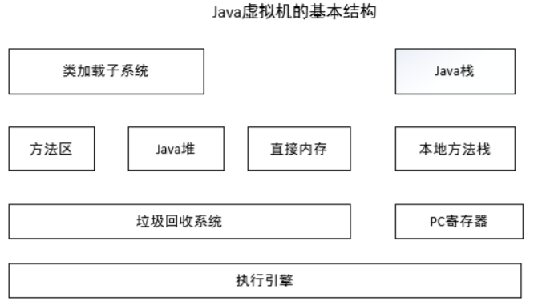

## JVM结构

### 类加载子系统和方法区

类加载子系统负责从文件系统或者网络中加载 Class 信息，加载的类信息存放于一块称
为方法区的内存空间。除了类的信息外，方法区中可能还会存放运行时常量池信息，包括字符串字面量和数字常量（这部分常量信息是 Class 文件中常量池部分的内存映射）。

### Java堆

Java堆在虚拟机启动的时候建立，它是Java程序最主要的内存工作区域。几乎所有的Java对象实例都存放在Java堆中。堆空间是所有线程共享的，这是一块与Java应用密切相关的内存空间。

### 直接内存

java 的 NIO 库允许 java 程序使用直接内存。直接内存是在 java 堆外的、直接向系统申请的内存空间。通常访问直接内存的速度会优于 java 堆。因此出于性能的考虑，读写频繁的场合可能会考虑使用直接内存。由于直接内存在 java 堆外，因此它的大小不会直接受限于 Xmx 指定的最大堆大小，但是系统内存是有限的，java 堆和直接内存的总和依然受限于操作系统能给出的最大内存。

### 垃圾回收系统

垃圾回收系统是 java 虚拟机的重要组成部分，垃圾回收器可以对方法区、java 堆和直接内存进行回收。其中，java 堆是垃圾收集器的工作重点。和 C/C++不同，java 中所有的对象空间释放都是隐式的，也就是说，java 中没有类似 free()或者 delete()这样的函数释放指定的内存区域。对于不再使用的垃圾对象，垃圾回收系统会在后台默默工作，默默查找、标识并释放垃圾对象，完成包括 **java 堆、方法区和直接内存中的全自动化管理**。

### Java栈

每一个 java 虚拟机线程都有一个私有的 java 栈，一个线程的 java 栈在线程创建的时候被创建，java 栈中保存着帧信息，java 栈中保存着局部变量、方法参数，同时和 java 方法的调用、返回密切相关。

### 本地方法栈

本地方法栈和 java 栈非常类似，最大的不同在于 java 栈用于方法的调用，而本地方法栈则用于本地方法的调用，作为对 java 虚拟机的重要扩展，java 虚拟机允许 java 直接调用本地方法（通常使用 C 编写）

### PC寄存器

PC（Program Counter）寄存器也是每一个线程私有的空间，java 虚拟机会为每一个 java线程创建 PC 寄存器。在任意时刻，一个 java 线程总是在执行一个方法，这个正在被执行的方法称为当前方法。如果当前方法不是本地方法，PC 寄存器就会指向当前正在被执行的指令。如果当前方法是本地方法，那么 PC 寄存器的值就是 undefined

### 执行引擎

执行引擎是 java 虚拟机的最核心组件之一，它负责执行虚拟机的字节码，现代虚拟机为了提高执行效率，会使用即时编译(just in time)技术将方法编译成机器码后再执行。Java HotSpot Client VM(-client)，为在客户端环境中减少启动时间而优化的执行引擎；本地应用开发使用。（如：eclipse）Java HotSpot Server VM(-server)，为在服务器环境中最大化程序执行速度而设计的执行引擎。应用在服务端程序。（如：tomcat）

#### Java HotSpot Client 模式和 Server 模式的区别

当虚拟机运行在-client 模式的时候,使用的是一个代号为 C1 的轻量级编译器, 而-server模式启动的虚拟机采用相对重量级,代号为 C2 的编译器. C2 比 C1 编译器编译的相对彻底,服务起来之后,性能更高。
JDK 安装目录/jre/lib/（x86、i386、amd32、amd64）/jvm.cfg
文件中的内容，-server 和-client 哪一个配置在上，执行引擎就是哪一个。如果是 JDK1.5版本且是 64 位系统应用时，-client 无效。
	--64 位系统内容
		-server KNOWN
		-client IGNORE
	--32 位系统内容
		-server KNOWN
		-client KNOWN
**注意**：在部分 JDK1.6 版本和后续的 JDK 版本(64 位系统)中，-client 参数已经不起作用了，Server 模式成为唯一

## 堆结构及对象分代

### 什么是分代，分代的必要性是什么

Java虚拟机根据对象存活的周期不同，把堆内存分为新生代、老年代和永久代（对HotSpot虚拟机而言），这就是JVM的内存分代策略。

