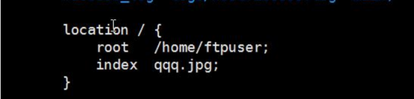

- [VSFTPD](#vsftpd)
- [FtpClient](#ftpclient)
- [Nginx](#nginx)
  - [反向代理](#反向代理)
  - [负载均衡](#负载均衡)
  - [为什么要用Nginx](#为什么要用nginx)
  - [Nginx四个主要组成部分](#nginx四个主要组成部分)
- [安装配置](#安装配置)

## VSFTPD

sftpd 是“very secure FTP daemon”的缩写，安全性是它的一个最大的特点。vsftpd 是一个 UNIX 类操作系统上运行的服务器的名字，它可以运行在诸如 Linux、BSD、Solaris、 HP-UNIX等系统上面。是一个完全免费的、开放源代码的ftp服务器软件，支持很多其他的 FTP 服务器所不支持的特征。

安装到 Linux 后通过 java 代码(FtpClient)实现文件上传。

**为什么要使用VSFTPD**

使用VSFTPD后，上传的图片会存放图片服务器中，不同的Tomcat都能够访问到。

## FtpClient

java 技术，使用 FtpClient 使用使用 java 代码上传文件到 vsftpd 服务端

**代码示例：**

````java
FTPClient ftp = new FTPClient();
//设置 ip 和端口,写在用户名和密码上面
ftp.connect("192.168.139.131", 21);
//设置用户名和密码
ftp.login("ftpuser", "ftpuser");
//设置文件类型
ftp.setFileType(FTPClient.BINARY_FILE_TYPE);
InputStream is = new
FileInputStream("E:/timg.jpg");
//第一个参数存储时名称
ftp.storeFile("abc.jpg", is);
//退出
ftp.logout();
````

````xml
<!-- ftpclient -->
<dependency>
    <groupId>commons-net</groupId>
    <artifactId>commons-net</artifactId>
</dependency>
````

**开发中一般使用FtpUtil工具类向FTP服务器上传、下载文件**


## Nginx

Nginx是一款轻量级的Web 服务器/反向代理服务器及电子邮件（IMAP/POP3）代理服务器。 Nginx 主要提供反向代理、负载均衡、动静分离(静态资源服务)等服务。

### 反向代理

- **正向代理：**某些情况下，代理我们用户去访问服务器，需要用户手动的设置代理服务器的ip和端口号。客户端知道最终要访问的服务器地址。
- **反向代理：** 是用来代理服务器的，代理我们要访问的目标服务器。代理服务器接受请求，然后将请求转发给内部网络的服务器，并将从服务器上得到的结果返回给客户端，此时代理服务器对外就表现为一个服务器。客户端只知道代理服务器地址，而不知道真实访问的服务器地址。

简单的理解，就是正向代理是为客户端做代理，代替客户端去访问服务器，而反向代理是为服务器做代理，代替服务器接受客户端请求。


### 负载均衡

在高并发情况下需要使用，其原理就是将并发请求分摊到多个服务器执行，减轻每台服务器的压力，多台服务器(集群)共同完成工作任务，从而提高了数据的吞吐量。

Nginx支持的weight轮询（默认）、ip_hash、fair、url_hash这四种负载均衡调度算法，感兴趣的可以自行查阅。

负载均衡相比于反向代理更侧重的是将请求分担到多台服务器上去，所以谈论负载均衡只有在提供某服务的服务器大于两台时才有意义。

````shell
节点说明：
在http节点里添加:

#定义负载均衡设备的 Ip及设备状态 
upstream myServer {   
    server 127.0.0.1:9090 down; 
    server 127.0.0.1:8080 weight=2; 
    server 127.0.0.1:6060; 
    server 127.0.0.1:7070 backup; 
}

在需要使用负载的Server节点下添加

proxy_pass http://myServer;

upstream 每个设备的状态:

down 表示单前的server暂时不参与负载 
weight  默认为1. weight越大，负载的权重就越大。 
max_fails ：允许请求失败的次数默认为1.当超过最大次数时，返回proxy_next_upstream 模块定义的错误 
fail_timeout:max_fails 次失败后，暂停的时间。 
backup： 其它所有的非backup机器down或者忙的时候，请求backup机器。所以这台机器压力会最轻。
````

### 为什么要用Nginx

**Nginx 有以下5个优点：**

1. 高并发、高性能（这是其他web服务器不具有的）
2. 可扩展性好（模块化设计，第三方插件生态圈丰富）
3. 高可靠性（可以在服务器行持续不间断的运行数年）
4. 热部署（这个功能对于 Nginx 来说特别重要，热部署指可以在不停止 Nginx服务的情况下升级 Nginx）
5. BSD许可证（意味着我们可以将源代码下载下来进行修改然后使用自己的版本）

### Nginx四个主要组成部分

- Nginx 二进制可执行文件：由各模块源码编译出一个文件
- nginx.conf 配置文件：控制Nginx 行为
- acess.log 访问日志： 记录每一条HTTP请求信息
- error.log 错误日志：定位问题


## 安装配置

[Nginx安装](manual/nginx安装.md)

**nginx 配置(已经安装完成)**

进入到 nginx/conf 文件夹修改 nginx.conf

- 赋予 ftpuser 用户权限

  

- 设置代理的目录

  - root：代理的目录
  - index：欢迎项
  - 如果只配置 root 不配置 index，在浏览器输入 ip 后依然报403

  