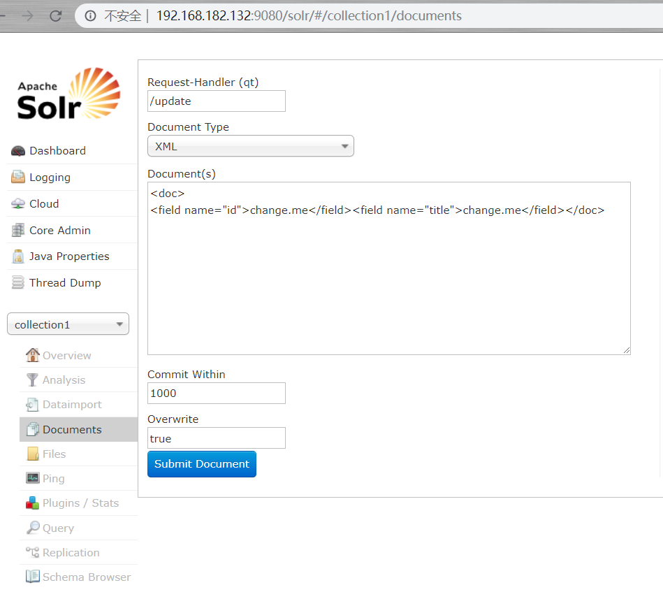
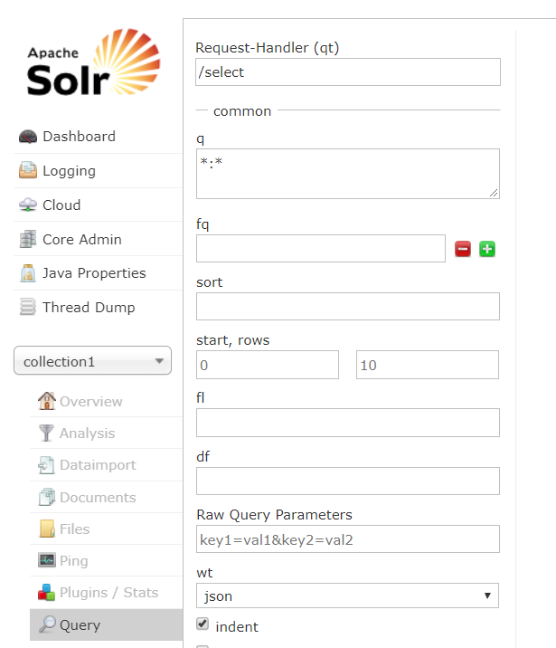
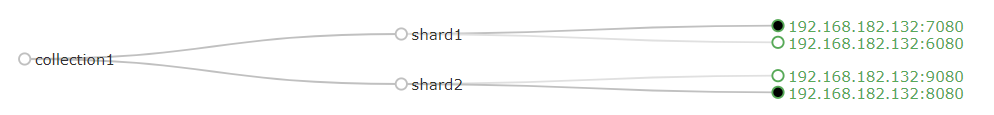

- [Solr简介](#solr简介)
- [IK Analyzer 中文拆词器](#ik-analyzer-中文拆词器)
- [Solr管理界面](#solr管理界面)
- [documents菜单功能](#documents菜单功能)
- [quey菜单功能](#quey菜单功能)
- [SolrCloud](#solrcloud)
- [Solr数据初始化](#solr数据初始化)

## Solr简介

是 Apache 下的一个顶级开源项目，采用 Java 开发，它是基于 Lucene 的全文搜索服务器。Solr 提供了比 Lucene更为丰富的查询语言，同时实现了可配置、可扩展，并对索引、搜索性能进行了优化。

Solr 可以独立运行，运行在 Jetty、Tomcat 等这些 Servlet 容器中，Solr 索引的实现方法很简单，用 POST 方法向 Solr 服务器发送一个描述 Field 及其内容的 XML 文档，Solr 根据 xml 文档添加、删除、更新索引。Solr 搜索只需要发送 HTTP GET 请求，然后对 Solr 返回 Xml、json 等格式的查询结果进行解析，组织页面布局。Solr 不提供构建 UI 的功能，Solr 提供了一个管理界面，通过管理界面可以查询 Solr 的配置和运行情况。

**Solr与Lucene的区别**
Lucene是一个开放源代码的全文检索引擎工具包，它不是一个完整的全文检索引擎，Lucene提供了完整的查询引擎和索引引擎，目的是为软件开发人员提供一个简单易用的工具包，以方便的在目标系统中实现全文检索的功能，或者以Lucene为基础构建全文检索引擎。

Solr的目标是打造一款企业级的搜索引擎系统，它是一个**搜索引擎服务**，可以独立运行，通过Solr可以非常快速的构建企业的搜索引擎，通过 Solr 也可以高效的完成站内搜索功能。

**Solr 是基于索引进行查询的**

反向键索引：把内容中进行拆分


## IK Analyzer 中文拆词器

Solr 默认对中文拆词功能支持不好，所以需要使用 IK Analyzer 拆词器。

配置 IK Analyzer 时本质实际上是给 solr 新建了一个 filedType，只要某个属性(field)是这个类型，这个属性就会使用 IK Analyzer 进行拆词。

## Solr管理界面

### documents菜单功能



- 包含了 solr 数据的新增、删除、修改三个功能.。

- 数据支持很多种格式：json 或 xml 等。

- 新增时,必须包含对 id 的新增 

- 每次新增，Solr 会新建一个 SolrDocument 对象。这个对象存储新增内容。
  - 把 SolrDocument 理解成实体类
  - 包含了 Solr 的 schema.xml 中配置的所有 field
  - 新增时有什么属性,最终显示时就只有什么属性

- 把 DocumentType 以 xml 方式举例

  ```xml
  <!-- 新增 -->
  <doc>
  <field name="id">change.me</field>
  <field name="title">change.me</field>
  </doc>
  <!-- 修改: 只要 id 已经存在执行修改 -->
  
  <!-- 删除 根据id删除 -->
  <delete>
  <id>id 内容</id>
  <delete>
  <commit/>
  <!-- 删除全部 -->
  <delete>
  <query>*:*</query>
  </delete>
  <commit/>
  ```

  

### quey菜单功能



- q 表示查询条件

  - `\*:*` 查询全部

  - `java:java 基础`

    把 java 基础拆分成 java 和基础，按照 java 和基础在 java 属性中进行搜索。

  - `java:"java 基础"`：java 基础不会被拆词


## SolrCloud

solr 是 web 项目，需要放入到 tomcat 中。依赖多个 tomcat，让多个tomcat 之间能够通信。需要借助 zookeeper 实现 tomcat 之间通信。



## Solr数据初始化

**pom.xml**

```xml
<!-- solrj -->
<dependency>
    <groupId>org.apache.solr</groupId>
    <artifactId>solr-solrj</artifactId>
</dependency>
```

**solr.xml**

```java
<?xml version="1.0" encoding="UTF-8"?>
<beans xmlns="http://www.springframework.org/schema/beans"
	xmlns:xsi="http://www.w3.org/2001/XMLSchema-instance"
	xmlns:context="http://www.springframework.org/schema/context"
	xmlns:dubbo="http://code.alibabatech.com/schema/dubbo"
	xsi:schemaLocation="http://www.springframework.org/schema/beans 
	http://www.springframework.org/schema/beans/spring-beans.xsd
	http://www.springframework.org/schema/context 
	http://www.springframework.org/schema/context/spring-context.xsd
	http://code.alibabatech.com/schema/dubbo 
	http://code.alibabatech.com/schema/dubbo/dubbo.xsd">

	<bean id="solrClient" class="org.apache.solr.client.solrj.impl.CloudSolrClient">
		<constructor-arg type="java.lang.String" value="192.168.182.132:2181,192.168.182.132:2182,192.168.182.132:2183">
		</constructor-arg>
		<property name="defaultCollection" value="collection1"></property>
	</bean>	
</beans>
```

**接口**

```java
public interface TbItemService {
	//初始化
    void init() throws SolrServerException, IOException;
}
```

**实现类**

```java
@Service
public class TbItemServiceImpl implements TbItemService{
	@Reference
	private TbItemDubboService tbItemDubblServiceImpl;
	@Reference
	private TbItemCatDubboService tbItemCatDubboServiceImpl;
	@Reference
	private TbItemDescDubboService tbItemDescDubboServiceImpl;
	@Resource
	private CloudSolrClient solrClient;
	
	@Override
	public void init() throws SolrServerException, IOException {
		//删除所有
		solrClient.deleteByQuery("*:*");
		solrClient.commit();
		//查询所有正常状态的商品
		List<TbItem> listItem = tbItemDubblServiceImpl.selAllByStatus((byte)1);
		for (TbItem item : listItem) {
			//商品对应的类目信息
			TbItemCat cat = tbItemCatDubboServiceImpl.selById(item.getCid());
			//商品对应的描述信息
			TbItemDesc desc = tbItemDescDubboServiceImpl.selByItemId(item.getId());
			
			SolrInputDocument doc = new SolrInputDocument();
			doc.setField("id", item.getId());
			doc.setField("item_title", item.getTitle());
			doc.setField("item_sell_point", item.getSellPoint());
			doc.setField("item_price", item.getPrice());
			doc.setField("item_image", item.getImage());
			doc.setField("item_category_name", cat.getName());
			doc.setField("item_desc", desc.getItemDesc());
			doc.setField("item_updated", item.getUpdated());
			solrClient.add(doc);
		}
		solrClient.commit();
	}
}
```

**控制器**

```java
@Controller
public class TbItemController {
	@Resource
	private TbItemService tbItemServiceImpl;
	/**
	 * 初始化
	 * @return
	 */
	@RequestMapping(value = "solr/init",produces = "text/html;charset=utf-8")
	@ResponseBody
	public String init() {
		//初始化开始时间
		long start = System.currentTimeMillis();
		try {
			tbItemServiceImpl.init();
			//初始化结束时间
			long end = System.currentTimeMillis();
			return "初始化总时间："+(end-start)/1000+"秒";
		} catch (Exception e) {
			e.printStackTrace();
			return "初始化失败！";
		}
	}
}
```

