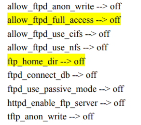
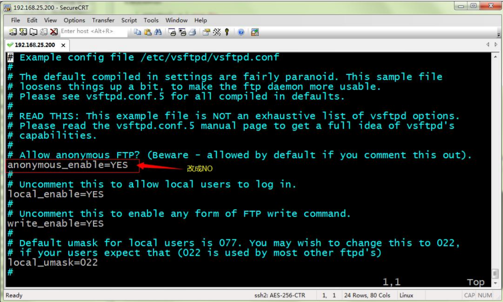

- [vsftpd组件安装](#vsftpd组件安装)
- [nginx安装](#nginx安装)

# Nginx安装

## vsftpd组件安装

1. **安装 vsftpd 组件**

   `yum -y install vsftpd`

   安装完后，有/etc/vsftpd/vsftpd.conf 文件，是 vsftp 的配置文件。

2. **添加一个 ftp 用户**

   `useradd ftpuse`

   此用户就是用来登录 ftp 服务器用的。

   这样一个用户建完，可以用这个登录，记得用普通登录不要用匿名了。登录后默认的路径为
   /home/ftpuser

3. **给 ftp 用户添加密码**

   `passwd ftpuser`

   输入两次密码后修改密码。

4. **防火墙开启 21 端口**

   `vim /etc/sysconfig/iptables`

   因为 ftp 默认的端口为 21，而 centos 默认是没有开启的，所以要修改 iptables 文件

   `service iptables restart`

   重启 iptables

5. **修改 selinux**

   外网是可以访问上去了，可是发现没法返回目录（使用 ftp 的主动模式，被动模式还是无法访问），也上传不了，因为 selinux 作怪了。

   修改 selinux：

   执行以下命令查看状态

   `getsebool -a | grep ftp`

   

   执行上面命令，再返回的结果看到两行都是 off，代表，没有开启外网的访问

   `setsebool -P allow_ftpd_full_access on`

   `setsebool -P ftp_home_dir on`

6. **关闭匿名访问**

   修改/etc/vsftpd/vsftpd.conf 文件:

   

   重启 ftp 服务:

   `service vsftpd restart`

7. **开启被动模式**

   默认是开启的，但是要指定一个端口范围，打开 vsftpd.conf 文件，在后面加上

   ```shell
   pasv_min_port=30000
   pasv_max_port=30999
   ```

   表示端口范围为 30000~30999，这个可以随意改。改完重启一下 vsftpd，由于指定这段端口范围，iptables 也要相应的开启这个范围，所以像上面那样打开 iptables 文件。
   也是在 21 上下面另起一行，更那行差不多，只是把 21 改为 30000:30999,然后:wq 保存，重启下 iptables。这样就搞定了。

8. **设置开机启动 vsftpd ftp 服务**

   `chkconfig vsftpd on`


## nginx安装

### nginx 安装环境

nginx 是 C 语言开发，建议在 linux 上运行，本教程使用 Centos6.5 作为安装环境。

**gcc**

安装 nginx 需要先将官网下载的源码进行编译，编译依赖 gcc 环境，如果没有 gcc 环境，需要安装 gcc：

`yum install gcc-c++ -y`

**PCRE**

PCRE(Perl Compatible Regular Expressions)是一个 Perl 库，包括 perl 兼容的正则表达式库。nginx 的 http 模块使用 pcre 来解析正则表达式，所以需要在 linux 上安装 pcre 库。

`yum install -y pcre pcre-devel`

注：pcre-devel 是使用 pcre 开发的一个二次开发库。nginx 也需要此库。

**zlib**

zlib 库提供了很多种压缩和解压缩的方式，nginx 使用 zlib 对 http 包的内容进行 gzip，所以需要在 linux 上安装 zlib 库。

`yum install -y zlib zlib-devel`

**openssl**

OpenSSL 是一个强大的安全套接字层密码库，囊括主要的密码算法、常用的密钥和证书封装管理功能及 SSL 协议，并提供丰富的应用程序供测试或其它目的使用。

nginx 不仅支持 http 协议，还支持 https（即在 ssl 协议上传输 http），所以需要在 linux安装 openssl 库。

`yum install -y openssl openssl-devel`

### 编译安装

1. **将 nginx-1.8.0.tar.gz 拷贝至 linux 服务器**

   解压：`tar -zxvf nginx-1.8.0.tar.gz`

   `cd nginx-1.8.0`

2. **configure**

   `./configure --help` 查询详细参数（参考本教程附录部分：nginx 编译参数）

   参数设置如下：

   ```
   ./configure \
   --prefix=/usr/local/nginx \
   --pid-path=/var/run/nginx/nginx.pid \
   --lock-path=/var/lock/nginx.lock \
   --error-log-path=/var/log/nginx/error.log \
   --http-log-path=/var/log/nginx/access.log \
   --with-http_gzip_static_module \
   --http-client-body-temp-path=/var/temp/nginx/client \
   --http-proxy-temp-path=/var/temp/nginx/proxy \
   --http-fastcgi-temp-path=/var/temp/nginx/fastcgi \
   --http-uwsgi-temp-path=/var/temp/nginx/uwsgi \
   --http-scgi-temp-path=/var/temp/nginx/scgi
   ```

   **注意：上边将临时文件目录指定为/var/temp/nginx，需要在/var 下创建 temp 及 nginx 目录**

3. **编译安装**

   `make`

   `make install`

   安装成功查看安装目录

### 启动nginx

`cd /usr/local/nginx/sbin/`

`./nginx`

查询 nginx 进程：`ps aux|grep nginx`

**注意**：执行./nginx 启动 nginx，这里可以-c 指定加载的 nginx 配置文件，如下：

`./nginx -c /usr/local/nginx/conf/nginx.conf`

如果不指定-c，nginx 在启动时默认加载 conf/nginx.conf 文件，此文件的地址也可以在编译安装 nginx 时指定./configure 的参数（--conf-path= 指向配置文件（nginx.conf））

### 停止 nginx

**方式 1，快速停止：**

`cd /usr/local/nginx/sbin`

`./nginx -s stop`

此方式相当于先查出 nginx 进程 id 再使用 kill 命令强制杀掉进程。

**方式 2，完整停止(建议使用)：**

`cd /usr/local/nginx/sbin`

`./nginx -s quit`

此方式停止步骤是待 nginx 进程处理任务完毕进行停止。

### 重启 nginx

**方式 1，先停止再启动（建议使用）：**
对 nginx 进行重启相当于先停止 nginx 再启动 nginx，即先执行停止命令再执行启动命令。如下：
`./nginx -s quit`
`./nginx`
**方式 2，重新加载配置文件：**
当 nginx 的配置文件 nginx.conf 修改后，要想让配置生效需要重启 nginx，使用-s reload 不用先停止 nginx 再启动 nginx 即可将配置信息在 nginx 中生效，如下：
`./nginx -s reload`

### 测试

nginx 安装成功，启动 nginx，即可访问虚拟机上的 nginx：


到这说明 nginx 上安装成功。

### 开机自启动 nginx

**编写 shell 脚本**

这里使用的是编写 shell 脚本的方式来处理

`vi /etc/init.d/nginx` (输入下面的代码)

```shell
#!/bin/bash
# nginx Startup script for the Nginx HTTP Server
# it is v.0.0.2 version. 
# chkconfig: - 85 15
# description: Nginx is a high-performance web and proxy server. 
# 				It has a lot of features, but it's not for everyone. 
# processname: nginx
# pidfile: /var/run/nginx.pid
# config: /usr/local/nginx/conf/nginx.conf
nginxd=/usr/local/nginx/sbin/nginx
nginx_config=/usr/local/nginx/conf/nginx.conf
nginx_pid=/var/run/nginx.pid
RETVAL=0
prog="nginx" 
# Source function library.
. /etc/rc.d/init.d/functions
# Source networking configuration.
. /etc/sysconfig/network
# Check that networking is up.
[ ${NETWORKING} = "no" ] && exit 0
[ -x $nginxd ] || exit 0
# Start nginx daemons functions. 
start() {
if [ -e $nginx_pid ];then
	echo "nginx already running...." 
	exit 1
fi
	echo -n $"Starting $prog: " 
	daemon $nginxd -c ${nginx_config}
	RETVAL=$?
	echo
	[ $RETVAL = 0 ] && touch /var/lock/subsys/nginx
	return $RETVAL
}
# Stop nginx daemons functions. 
stop() {
	echo -n $"Stopping $prog: " 
	killproc $nginxd
	RETVAL=$?
	echo
	[ $RETVAL = 0 ] && rm -f /var/lock/subsys/nginx /var/run/nginx.pid
}
# reload nginx service functions. 
reload() {
	echo -n $"Reloading $prog: " 
	#kill -HUP `cat ${nginx_pid}` 
	killproc $nginxd -HUP
	RETVAL=$?
	echo
}
# See how we were called. 
case "$1" in
start)
	start
	;;
stop)
	stop
	;;
reload)
	reload
	;;
restart)
	stop
	start
	;;
status)
	status $prog
	RETVAL=$?
	;; 
*)
	echo $"Usage: $prog {start|stop|restart|reload|status|help}" 
	exit 1
esac
exit $RETVAL
```

:wq 保存并退出

### 设置文件的访问权限

`chmod a+x /etc/init.d/nginx` (a+x ==> all user can execute 所有用户可执行)

这样在控制台就很容易的操作 nginx 了：查看 Nginx 当前状态、启动 Nginx、停止 Nginx、重启 Nginx…

如果修改了 nginx 的配置文件 nginx.conf，也可以使用上面的命令重新加载新的配置文件并运行，可以将此命令加入到 rc.local 文件中，这样开机的时候 nginx 就默认启动了。

### 加入到 rc.local 文件中

`vi /etc/rc.local`
加入一行 `/etc/init.d/nginx start` 保存并退出，下次重启会生效。