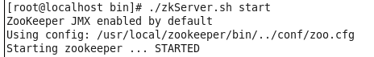
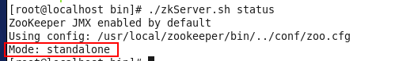

- [单机版安装步骤](#单机版安装步骤)
- [集群安装步骤](#集群安装步骤)

# zookeeper安装

## 单机版安装步骤

**前提: 已经配置好JDK环境变量**

1. 上传zookeeper 安装包到linux中/usr/local/temp 中(目录随意,对安装无影响)

2. 解压zookeeper压缩包

   `tar zxvf /usr/local/temp/zookeeper-3.4.8.tar.gz`

3. 复制zookeeper解压后的文件夹到/usr/local下并起名为zookpper(复制后名称任意,对安装无影响)

   `cp -r /usr/local/temp/zookeeper-3.4.8  /usr/local/zookeeper`

4. 进入到zookeeper文件夹中

   `cd /usr/local/zookeeper`

5. 在zookeeper中新建data文件夹,做为zookeeper数据存储文件夹

   `mkdir data`

6. 进入到conf文件夹

   `cd conf`

7. 复制zoo_sample.cfg,并给新起名的zoo.cfg

   `cp zoo_sample.cfg zoo.cfg`

8. 修改zoo.cfg中dataDir属性值为新建data文件夹的路径

   `vim zoo.cfg`

   修改后的效果

U7.png)

1. 进入到zookeeper/bin文件夹,使用zkServer.sh启动zookeeper

   `cd ../bin`

   `./zkServer.sh start`

   启动成功效果图
   
   

10. 查看状态,其中Mode: standalone表示单机版

    `./zkServer.sh status`
    
    
    
11. 为了外部能访问,需要在防火墙中放行**2181**端口

## 集群安装步骤

**使用zookeeper可以进行管理solr集群**

1. 上传压缩包到/usr/local/tmp下,并解压.

2. 在/usr/local下新建文件夹zookeeper

   `mkdir /usr/local/zookeeper`

3. 把解压的所文件夹复制到zookeeper下,并命名为zk1

   `cp -r /usr/local/temp/zookeeper-3.4.8 /usr/local/zookeeper/zk1`

4. 在zk1下新建文件夹data

5. 在data下新建文件myid,里面写上1

   `vim myid`

6. 进入到zk1/conf下把zoo_sample.cfg复制一份叫做zoo.cfg

7. 编辑zoo.cfg内容,设置dataDIR为data文件夹,并在文件最下面添加下面内容

   `server.1=192.168.213.130:2688:3888 `

   `server.2=192.168.213.130:2689:3889 `

   `server.3=192.168.213.130:2690:3890 `

   - server.1 中的1 是myid的内容

   - 2688,2689,2690 是zookeeper内部端口

   - 3888,3889,3890 是leader端口

8. 把zk1复制两份,分别叫做zk2,zk3,并修改myid的值为2,3 修改zoo.cfg中dataDIR和clientPort

9. 启动三个zookeeper

   `./zkServer.sh start`

10. 查看状态

    `./zkServer.sh status`

 

 