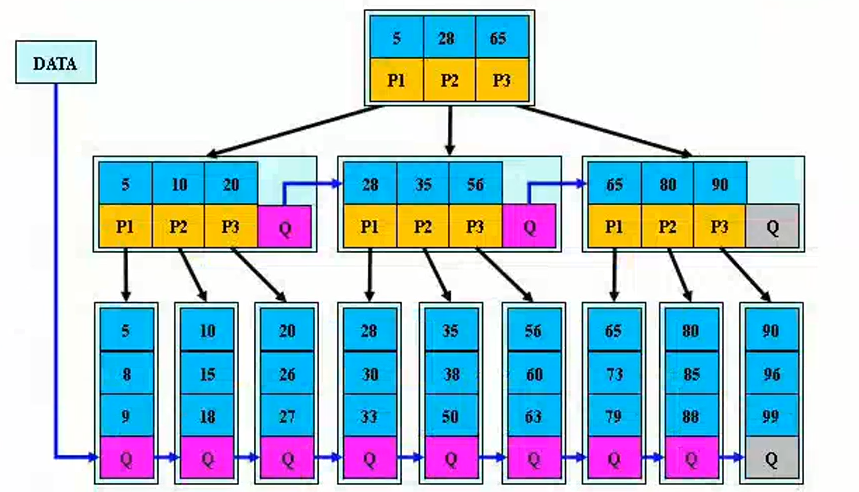

- [数据结构与算法入门](#数据结构与算法入门)
  - [基本概念](#基本概念)
  - [数据结构类型](#数据结构类型)
  - [算法时间复杂度(Time Complexity)](#算法时间复杂度(Time Complexity))
- [线性表](#线性表)
  - [线性表及其结构](#线性表及其结构)
  - [顺序表实现](#顺序表实现)
  - [单链表实现](#单链表实现)
  - [其他链表](#其他链表)
- [栈和队列](#栈和队列)
  - [栈](#栈)
  - [队列](#队列)
  - [Java中的栈和队列类](#Java中的栈和队列类)
- [树和二叉树](#树和二叉树)
  - [树的基本概念](#树的基本概念)
  - [二叉树](#二叉树)
  - [二叉树的实现](#二叉树的实现)
- [图](#图)
- [查找](#查找)
  - [线性表查找](#线性表查找)
  - [查找树](#查找树)
  - [哈希表查找](#哈希表查找)
  - [Java中的查找树和哈希表](#Java中的查找树和哈希表)
- [排序](#排序)
  - [排序基本概念](#排序基本概念)
  - [交换排序](#交换排序)
  - [选择排序](#选择排序)
  - [插入排序](#插入排序)
  - [各种排序比较](#各种排序比较)

## 数据结构与算法入门

### 为什么要学习数据结构

- 高级计算机程序设计的理论指导
- 提升编程能力
  - 数据结构是编程最重要的基本功

### 有哪些数据结构

- 线性表、栈、队列、(字符)串、数组、广义表、树、二叉树、图
- 重点是线性表、二叉树

### 学习数据结构的四种境界

- 境界1：听懂理论、听懂算法思路（理论家、眼高手低，总比不知道强多了）
- 境界2：完成要数据结构基本算法的实现（理论+实践，数据结构入门了）
- 境界3：完成更多数据结构更多算法的实现（进步提高数据结构功底）
- 境界4：融会贯通、举一反三，在后续开发中综合应用数据结构知识（数据结构就是哲学思想，只要和实践结合才能学好）

### 基本概念

#### 数据

- 数据（data）是描述客观事物的数值、字符以及能输入机器且能被处理的各种符号集合。
- 数据的含义非常广泛，除了通常的数值数据、字符、字符串是数据以外，声音、图像等一切可以输入计算机并能被处理的都是数据。
- 例如除了表示人的姓名、身高、体重等的字符、数字是数据，人的照片、指纹、三维模型、语音指令等也都是数据。

#### 数据项

- 数据项（dataitem）具有原子性，是不可分割的最小数据单位。
- 如描述学生相关信息的姓名、性别、学号等都是数据项；
- 三维坐标中的每一维坐标值也是数据项。数据项具有原子性，是不可分割的最小单位。

#### 数据元素

- 数据元素（data element）是数据的基本单位，是数据集合的个体，通常由若干个数据项组成，在计算机程序中通常作为一个整体来进行处理。
- 例如一条描述一位学生的完整信息的数据记录就是一个数据元素；空间中一点的三维坐标也可以是一个数据元素。

#### 数据对象

- 数据对象（data object）是性质相同的数据元素的集合，是数据的子集。

- 例如一个学校的所有学生的集合就是数据对象，空间中所有点的集合也是数据对象。

  

#### 数据结构

- 数据结构（data structure）是指相互之间存在一种或多种特定关系的数据元素的集合。
- 是组织并存储数据以便能够有效使用的一种专门格式，它用来反映一个数据的内部构成，即一个数据由那些成分数据构成，以什么方式构成，呈什么结构。
- 由于信息可以存在于逻辑思维领域，也可以存在于计算机世界，因此作为信息载体的数据同样存在于两个世界中。
- 表示一组数据元素及其相互关系的数据结构同样也有两种不同的表现形式，
  - 一种是数据结构的逻辑层面，即数据的逻辑结构；
  - 一种是存在于计算机世界的物理层面，即数据的存储结构。
- 数据结构=逻辑结构+存储结构
- 数据结构=逻辑结构+存储结构+（在存储结构上的）运算/操作

### 数据结构类型

- 运算的实现依赖于存储结构，存储结构不唯一，逻辑结构唯一
- **逻辑结构**：数据元素之间的逻辑关系（和实现无关）。
  - 线性结构：有且只有一个开始结点和一个终端结点，并且所有结点都最多只有一个直接前驱和一个直接后继。
    - 线性表、栈、队、串、数组
  - 非线性结构：逻辑特征是一个结点元素可能对应多个直接前驱和多个直接后继。
    - 树形结构
    - 图形结构
- **存储结构**：主要包括数据元素本身的存储以及数据元素之间关系表示，是数据的逻辑结构在计算机中的表示。
  - 顺序存储
    - 优点：节省存储空间
    - 缺点：插入和删除需要移动元素，效率低
  - 链式存储
  - 索引存储
  - 散列存储
- **数据运算**
  - 检索、排序、插入、删除、修改等

### 算法

- 指令的集合，是为解决特定问题而规定的一系列操作；简单的说：算法就是计算机解题的过程
- 五个特征
  - 输入：一个算法应以待解决的问题的信息作为输入。
  - 输出：输入对应指令集处理后得到的信息。
  - 可行性：算法是可行的，即算法中的每一条指令都是可以实现的，均能在有限的时间内完成。
  - 有穷性：算法执行的指令个数是有限的，每个指令又是在有限时间内完成的，因此整个算法也是在有限时间内可以结束的。
  - 确定性：算法对于特定的合法输入，其对应的输出是唯一的。即当算法从一个特定输入开始，多次执行同一指令集结果总是相同的。
- 举例：如何求(0+)+1+2+3+...+10000=?
  - 依次相加
  - 高斯解法：梯形解法-->(1+10000)\*10000/2,三角形解法-->10000*10001/2
  - 递归实现

### 算法时间复杂度(Time Complexity)

- **时间频度**
  - 一个算法中的语句执行次数称为语句频度或时间频度，表示为T(n)，n表示问题的规模
- **时间复杂度**
  - 若有某个辅助函数f(n)，使得当n超近于无穷大时，T(n)/f(n)的极限值为不等于零的常数，则称(n)是T(n)的同数量级函数。记作**T(n)=O(f(n))**，称O(f(n))为算法的渐进时间复杂度，简称时间复杂度。
  - 或者说：时间复杂度就是时间频度去掉低阶项和首项常数。
- **最坏时间复杂度和平均时间复杂度**
  - 最坏情况下的时间复杂度称最坏时间复杂度。一般不特别说明，讨论的时间复杂度均是最坏情况下的时间复杂度。
  - 平均时间复杂度是指所有可能的输入实例均以等概率出现的情况下，算法的期望运行时间。
  - 为了进一步说明算法的时间复杂度，我们定义O、Ω、Θ符号。
    - O（欧米可荣）符号给出了算法时间复杂度的上界（最坏情况<=），比如T（n）=O（n2）
    - Ω（欧米伽）符号给出了时间复杂度的下界(最好情况>=)，比如T（n）=Ω（n2）
    - Θ（西塔）给出了算法时间复度的精确阶(最好和最坏是同一个阶=)，比如T（n）=Θ（n2）
- **时间复杂度计算**
  - 根本没有必要计算时间频度，即使计算处理还要忽略常量、低次幂和最高次幂的系数，所以可以采用如下简单方法：
    - 找出算法中的基本语句
      - 算法中执行次数最多的那条语句就是基本语句，通常是最内层循环的循环体。
    - 计算基本语句的执行次数的数量级
      - 只需计算基本语句执行次数的数量级，这就意味着只要保证基本语句执行次数的函数中的最高次幂正确即可，可以忽略所有低次幂和最高次幂的系数。这样能够简化算法分析，并且使注意力集中在最重要的一点上：增长率。
    - 用大O记号表示算法的时间性能
      - 将基本语句执行次数的数量级放入大O记号中。

### 空间复杂度

- 空间复杂度是对一个算法在运行过程中临时占用的存储空间大小的量度，一般也作为问题规模n的函数，以数量级形式给出，记作：S（n）=O（g（n））
- 注意：
  - 空间复杂度相比时间复杂度分析要少
  - 对于递归算法来说，代码一般都比较简短，算法本身所占用的存储空间较少，但运行时需要占用较多的临时工作单元；若写成非递归算法，代码一般可能比较长，算法本身占用的存储空间较多，但运行时将可能需要较少的存储单元。

---


## 线性表

### 线性表及其结构

线性表是n个类型相同数据元素的有限序列，通常记作（a~0~，a~1~，...a~i-1~，a~i~，a~i+1~…a~n-1~）

- 相同数据类型
- 序列(顺序性)
- 有限

#### 存储结构

##### 顺序表--顺序存储结构

- 特点：在内存中分配连续的空间，只存储数据，不需要存储地址信息，位置就隐含着地址
- 优点
  - 节省存储空间
  - 索引查询效率高，即每一个结点对应一个序号，由该序号可以直接计算出来结点的存储地址
    - 线性表起始地址+元素大小*索引
- 缺点
  - 插入和删除操作需要移动元素，效率较低
  - 必须提前分配固定数量的空间，如果存储元素少，可能导致空闲浪费
  - 按照内容查询效率低，因为需要逐个比较判断

##### 链表--链式存储结构

- 特点
  - 数据元素的存储对应的是不连续的存储空间，每个存储结点对应一个需要存储的数据元素
  - 每个结点是由数据域和指针域组成。元素之间的逻辑关系通过存储节点之间的链接关系反映出来
  - 逻辑上相邻的节点物理上不必相邻
- 优点
  - 插入、删除灵活（不必移动节点，只要改变节点中的指针，但是需要先定位到元素上）
  - 有元素才会分配结点空间，不会有闲置的结点
- 缺点
  - 比顺序存储结构的存储密度小（每个节点都由数据域和指针域组成，所以相同空间内假设全存满的话顺序比链式存储更多）
  - 查找结点时链式存储要比顺序存储慢（每个节点地址不连续、无规律，导致按照索引查询效率低下）

### 顺序表实现

#### 手写ArrayList

**核心：数组的扩容**

```java
package com.cc.lineartable;
import java.util.Arrays;
/**
 * 顺序表
 * 底层采用的数组，但是长度可以动态的变化
 * @author chenc
 *
 */
public class ArrayList implements List{	
	private Object[] elementData;	//底层是数组，长度不确定	
	private int size; //数组中元素的个数	
	private static final int DEFAULT_CAPACITY = 10; //数组初始默认长度	
	//不指定数组初始长度，使用默认长度
	public ArrayList() {
		this(DEFAULT_CAPACITY);
	}	
	//指定数组的初始长度
	public ArrayList(int initialCapacity) {
		elementData = new Object[initialCapacity];
	}
	
	@Override
	public int size() {		
		return size;
	}

	@Override
	public Object get(int i) {
		if(i<0||i>=size) {
			throw new MyArrayIndexOutOfBoundsException("数组索引越界异常："+i);
		}
		return elementData[i];
	}

	@Override
	public boolean isEmpty() {
		return size==0;
	}

	@Override
	public void add(int i, Object e) {
		//i的位置要正确
		if(i<0 || i>size) {
			throw new MyArrayIndexOutOfBoundsException("数组索引越界异常："+i);
		}
		//什么时候扩容
		if(size == elementData.length) {
			grow();
		}
		//后移i及其后面元素，从最后一个元素开始
		for(int j=size;j>i;j--) {
			elementData[j] = elementData[j-1];
		}
		elementData[i] = e;
		size++;
	}

	@Override
	public void add(Object e) {	
		this.add(size, e);
	}
    
	//扩容的方法
	public void grow() {		
		//如何实现扩容
		elementData = Arrays.copyOf(elementData, elementData.length+(elementData.length>>1));
	}
    
	@Override
	public Object remove(int i) {
		Object oldValue = elementData[i];
		int numMoved = size-i-1;
		if(numMoved>0) {
			System.arraycopy(elementData, i+1, elementData, i, numMoved);
		}	
		elementData[--size] = null;
		return oldValue;
	}
    
	@Override
	public boolean remove(Object e) {
		for(int i=0;i<size;i++) {
			if(e.equals(get(i))) {
				remove(i);
			}
		}
		return false;
	}
    
	public String toString() {
		if(size == 0){
			return "[]";
		}
		StringBuilder builder = new StringBuilder("[");
		for(int i=0;i<size;i++) {
			builder.append(elementData[i]+",");
		}
		builder.setCharAt(builder.length()-1, ']');
		return builder.toString();
	}
}
```

### 单链表实现

- 在使用单链表实现线性表的时候，为了使程序更加简洁，我们通常在单链表的最前面添加一个哑元结点，也称为头结点。

- 在头结点中不存储任何实质的数据对象，其next域指向线性表中0号元素所在的结点，可以对空表、非空表的情况以及对首元结点进行统一处理，编程更方便，常用头结点。

  

  

  **代码：**

  ``` java
  /**
   * 单链表的结点
   * @author chenc
   */
  public class Node {
  	Object data;//要存储的数据
  	Node next;
  }
  ```

  ``` java
  /**
   * 单链表实现
   * @author chenc
   */
  public class SingleLinkedList implements List{	
  	private Node head = new Node();//头结点,不存储数据，方便编程
  	private int size; //一共有几个结点
  	
  	@Override
  	public int size() {
  		return size;
  	}
  
  	@Override
  	public Object get(int i) {
  		if(i<0||i>=size) {
  			throw new MyArrayIndexOutOfBoundsException("指针越界异常："+i);
  		}
  		//找到前一个结点，从head结点开始
  		Node p = head;
  		for(int j=0;j<=i;j++) {
  			p = p.next;
  		}
  		return p.data;
  	}
  
  	@Override
  	public boolean isEmpty() {
  		return size == 0;
  	}
  
  	@Override
  	public void add(int i, Object e) {
  		if(i<0||i>size) {
  			throw new MyArrayIndexOutOfBoundsException("指针越界异常："+i);
  		}
  		//找到前一个结点，从head结点开始
  		Node p = head;
  		for(int j=0;j<i;j++) {
  			p = p.next;
  		}
  		//新创建一个结点
  		Node newNode = new Node();
  		newNode.data = e;
  		//指明新结点的直接后继结点
  		newNode.next = p.next;
  		//指明新结点的直接前驱结点
  		p.next = newNode;
  		size++;
  	}
  
  	@Override
  	public void add(Object e) {
  		this.add(size, e);
  	}
  
  	@Override
  	public String toString() {
  		if(size==0) {
  			return "[]";
  		}
  		StringBuilder builder = new StringBuilder("[");
  		Node p = head.next;
  		for(int i=0;i<size;i++) {
  			if(i!=size-1) {
  				builder.append(p.data+",");
  			}else {
  				builder.append(p.data);
  			}
  			//移动指针到下一个结点
  			p = p.next;
  		}
  		builder.append("]");
  		return builder.toString();
  	}
  }
  ```

  

### 其他链表

##### 双向链表

- 单链表的一个优点是结构简单，但是它也有一个缺点，即在单链表中只能通过一个结点的引用访问其后续结点，而无法直接访问其前驱结点，要在单链表中找到某个结点的前驱结点，必须从链表的首结点出发依次向后寻找，但是需要O(n)时间。

- 为此我们可以扩展单链表的结点结构，使得通过一个结点的引用，不但能够访问其后续结点，也可以方便的访问其前驱结点。

- 扩展单链表结点结构的方法是，在单链表结点结构中新增加一个域，该域用于指向结点的直接前驱结点。

- 扩展后的结点结构是构成双向链表的结点结构，如图所示

  

- 在使用双向链表实现链接表时，为使编程更加简洁，我们使用带两个哑元结点的双向链表来实现链接表。

- 其中一个是头结点，另一个是尾结点，它们都不存放数据元素

- 头结点的pre为空，而尾结点的Next为空

- Java中LinkedList底层使用的就是双向链表

##### 循环链表

- 在一个循环链表中，首节点和末节点被连接在一起。这种方式在单向和双向链表中皆可实现。

- 要转换一个循环链表，你开始于任意一个节点然后沿着列表的任一方向直到返回开始的节点。

  

- 循环链表可以被视为“无头无尾"。

  

  

------


## 栈和队列


### 栈

#### 概念

- 栈（stack）又称堆栈，它是==运算受限==的线性表。

- 其限制是仅允许在表的一端进行插入和删除操作，不允许在其他任何位置进行插入、查找、删除等操作。

- 表中进行插入、删除操作的一端称为栈顶（top），栈顶保存的元素称为栈顶元素。

- 相对的，表的另一端称为栈底（bottom）

- 当栈中没有数据元素时称为空栈；向一个栈插入元素又称为进栈或入栈；从一个栈中删除元素又称为出栈或退栈。

- 由于栈的插入和删除操作仅在栈顶进行，后进栈的元素必定先出栈，所以又把堆栈称为==后进先出表==（Last In First Out，简称LIFO）

  **生活案例：**摞盘子和取盘子、一摞书、酒杯塔（各层之间可以简单理解为栈，每层内部不是栈）

  **技术案例：**Java的栈内存

  ``` java
  /*栈接囗，定义了栈的主要操作
  记住针对栈的专业词汇：push、pop、peek */
  public interface Stack{
      //返回堆栈的大小
      public int getsize();
      //判断堆栈是否为空
      public boolean isEmpty();
      //数据元素e入栈
      public void push(Object e();
      //栈顶元素出栈
      public Object pop();
      //取栈顶元素
      public Object peek();
  }
  ```

#### 栈的存储结构

- **顺序栈**
  - 和线性表类似，堆栈也有两种基本的存储结构：顺序存储结构和链式存储结构。
  - 顺序栈是使用顺序存储结构实现的堆栈，即利用一组地址连续的存储单元依次存放堆栈中的数据元素。
  - 由于堆栈是一种特殊的线性表，因此在线性表的顺序存储结构的基础上，选择线性表的一端作为栈顶即可。
  - 根据数组操作的特性，选择数组下标大的一端，即线性表顺序存储的表尾来作为栈顶，此时入栈、出栈等操作可以在O（1）时间完成。
  - 由于堆栈的操作都在栈顶完成，因此在顺序栈的实现中需要附设一个指针top来动态的指示栈顶元素在数组中的位置。
  - 通常top可以用栈顶元素所在数组下标来表示，top=-1时表示空栈。
- **链栈**
  - 链栈即采用链表作为存储结构实现的栈。
  - 当采用单链表存储线性表后，根据单链表的操作特性选择单链表的头部作为栈顶，此时，入栈、出栈等操作可以在O（1）内完成。
  - 由于堆栈的操作只在线性表的一端进行，在这里使用带头结点的单链表或不带头结点的单链表都可以。
  - 使用带头结点的单链表时，结点的插入和删除都在头结点之后进行；使用不带头结点的单链表时，结点的插入和删除都在链表的首结点上进行。

### 队列

#### 概念

- 队列（queue）简称队，它同堆栈一样，也是一种运算受限的线性表，其限制是仅允许在表的一端进行插入，而在表的另一端进行删除。

- 在队列中把插入数据元素的一端称为队尾（rear），删除数据元素的一端称为队首（front）

- 向队尾插入元素称为进队或入队，新元素入队后成为新的队尾元素；从队列中删除元素称为离队或出队，元素出队后，其后续元素成为新的队首元素。

- 由于队列的插入和删除操作分别在队尾和队首进行，每个元素必然按照进入的次序离队，也就是说先进队的元素必然先离队，所以称队列为==先进先出表==（First In First Out，简称FIFO）。

- **生活案例：**排队打饭，排队进地铁站，上地铁

- **技术案例：**多线程中就绪队列和阻塞队列

  ``` java
  //对于队列的主要操作是入队和出队操作
  public interface Queue{
      //返回队列的大小
      public int getSize();
      //判断队列是否为空
      public boolean isEmpty();
      //数据元素e入队
      public void enqueue();
      //队首元素出队
      public Object dequeue();
      //取队首元素
      public Object peek();
  }
  ```

#### 队列的存储结构

- **顺序队列**

  - 使用数组做存储结构

    - 缺点：通过出队操作将数据弹出队列后，front之前的空间还能够再次得到吗？

    - 不能。所以使用普通数组实现队列，就再也不能使用front之前的空间了，这会导致大量空间丢失

      

  - 使用循环数组做存储结构

    - 为了解决这个问题，将普通数组换成循环数组。在循环数组中，末尾元素的下一个元素不是数组外，而是数组的头元素。

    - 这样就能够再次使用front之前的存储空间了

      

- **链式队列**

  - ...

#### 双端队列

- deque double ended queue通常读为"deck"

- 所谓双端队列是指两端都可以进行进队和出队操作的队列，如下图所示，将队列的两端分别称为前端和后端，两端都可以入队和出队。其元素的逻辑结构仍是线性结构

  

- **输出受限的双端队列**：即一个端点允许插入和删除，另一个端点只允许插入的双端队列

  

- **输入受限的双端队列**：即一个端点允许插入和删除，另一个端点只允许删除的双端队列

  

- **双端队列既可以用来队列操作，也可以用来实现栈操作（只操作一端就是栈了）**

### Java中的栈和队列类

- **Stack类：栈类过时 public class Stack<E>extends Vector<E>**

- **Queue：队列类**

- **Deque：双端队列（栈操作建议使用）**

  - Java中实现栈和队列操作都可以通过使用LinkedList类实现，当然底层使用的链表

    ``` java
    //十进制转换成二进制
    public class TestConvert {
    	public static void main(String[] args) {
    		int n = 13;//十进制数
    		int k = 2;	//转换的进制
    		int t = n;
    		Deque<Integer> stack = new LinkedList<>();//定义一个空栈
    		do {
    			int mod = t % k;		
    			stack.push(mod);//入栈
    			t = t/k;
    		} while (t>0);
    		System.out.print(n+"--->");
    		while(!stack.isEmpty()) {
    			System.out.print(stack.pop());//出栈
    		}
    	}	
    }
    ```

----


## 树和二叉树

### 树的基本概念

#### 树（tree）是n（n≥0）个结点的有限集

- 或者是一棵空树（n=0），空树中不包含任何结点
- 或者是一棵非空树（n>0），此时有且仅有一个特定的称为根（root）的结点；当n>1时，其余结点可分为m（m>0）个互不相交的有限集T1，T2，…，Tm，其中每一个本身又是一棵树，并且称为根的子树（subtree）

#### 结点的度与树的度

- 结点拥有的子树的数目称为结点的度（Degree）
- 度为0的结点称为叶子（leaf）或终端结点
- 度不为0的结点称为非终端结点或分支结点。除根之外的分支结点也称为内部结点
- 树内各结点的度的最大值称为树的度

#### 结点的层次和树的深度

- 结点的层次（level））从根开始定义，层次数为1的结点是根结点，其子树的根的层次数为2

- 树中结点的最大层次数称为树的深度（Depth）或高度

  

#### 父亲、儿子、兄弟

- 父亲（parent）：一个结点的直接前驱结点
- 儿子（child）：一个结点的直接后继结点
- 兄弟（sibling）：同一个父亲结点的其他结点
- 结点A是结点B、C、D的父亲，结点B、C、D是结点A的孩子
- 由于结点H、I、J有同一个父结点D，因此它们互为兄弟

#### 祖先、子孙、堂兄弟

- 将父子关系进行扩展，就可以得到祖先、子孙、堂兄弟等关系
- 结点的祖先是从根到该结点路径上的所有结点
- 以某结点为根的树中的任一结点都称为该结点的子孙
- 父亲在同一层次的结点互为堂兄弟

#### 有序树、m叉树、森林

- 如果将树中结点的各子树看成是从左至右是有次序的，则称该树为有序树
- 若不考虑子树的顺序则称为无序树
- 对于有序树，我们可以明确的定义每个结点的第一个孩子、第二个孩子等，直到最后一个孩子
- 若不特别指明，一般讨论的树都是有序树
- 树中所有结点最大度数为m的有序树称为m叉树
- 森林（forest）是m（m≥0）棵互不相交的树的集合。对树中每个结点而言，其子树的集合即为森林。树和森林的概念相近。删去一棵树的根，就得到一个森林；反之，加上一个结点作树根，森林就变为一棵树

### 二叉树

#### 概念

- 每个结点的度均不超过2的有序树，称为二叉树（binary tree）。

- 与树的递归定义类似，二叉树的递归定义如下：

  - 二叉树或者是一棵空树，或者是一棵由一个根结点和两棵互不相交的分别称为根的左子树和右子树的子树所组成的非空树。
  - 由以上定义可以看出，二叉树中每个结点的孩子数只能是0、1或2个，并且每个孩子都有左右之分。
  - 位于左边的孩子称为左孩子，位于右边的孩子称为右孩子；以左孩子为根的子树称为左子树，以右孩子为根的子树称为右子树。

  ##### 满二叉树

  - 高度为k并且有2^(k+1)-1个结点的二叉树。
  - 在满二叉树中，每层结点都达到最大数，即每层结点都是满的，因此称为满二叉树。

  ##### 完全二叉树

  - 若在一棵满二叉树中，在最下层从最右侧起去掉相邻的若干叶子结点，得到的二叉树即为完全二叉树

    

  - 满二又树必为完全二叉树，而完全二叉树不一定是满二叉树

#### 性质

- 性质1：在二叉树的第i层上最多有2^(i-1)^个结点（根是第1层）
- 性质2：高度为h的二叉树至多有2^h-1^个结点
- 性质3：对任何一棵二叉树T，如果其终端结点数为n~o~，度为2的结点数为n~2~，则n~o~=n~2~+1
- 性质4：有n个结点的完全二叉树的高度为[log~2~n]+1，其中[log~2~n]是向下取整
- 性质5：含有n≥1个结点的二叉树的高度至多为n-1；高度至少为[log~2~n]+1，其中[log~2~n]是向下取整
- 性质6：如果对一棵有n个结点的完全二叉树的结点进行编号，则对任一结点i(1&le;i&le;n)，有
  - 如果i=1，则结点i是二叉树的根，无双亲；如果i>1，则其双亲结点PARENT(i)是结点Li/2J
  - 如果2i>n，则结点i无左孩子；否则其左孩子是结点2i
  - 如果2i+1>n，则结点i无右孩子；否则其右孩子是结点2i+1

#### 存储结构

- **顺序存储结构**

  - 对于满二叉树和完全二叉树来说，可以将其数据元素逐层存放到一组连续的存储单元中
  - 这种存储方式对于满二又树和完全二叉树是非常合适也是高效方便的
  - 但是对于一般的二叉树而言，必须用“虚结点”将一棵二叉树补成一棵完全二叉树来存储，否则无法确定结点之间的前驱后续关系，但是这样一来就会造成空间的浪费

- **链式存储结构**

  - 设计不同的结点结构可构成不同的链式存储结构
  - 在二叉树中每个结点都有两个孩子，则可以设计每个结点至少包括3个域：数据域、左孩子域和右孩子域
  - 数据域存放数据元素，左孩子域存放指向左孩子结点的指针，右孩子域存放指向右孩子结点的指针。如图(a)所示
  - 利用此结点结构得到的二叉树存储结构称为==二叉链表==
  - 为了方便找到父结点，可以在上述结点结构中增加一个指针域，指向结点的父结点。如图(b)所示
  - 采用此结点结构得到的二叉树存储结构称为==三叉链表==

  


### 二叉树的实现

#### 二叉树遍历策略

##### 遍历（Traverse）

- ==就是按照某种次序访问树中的所有结点，且每个结点恰好访问一次==
- 也就是说，按照被访问的次序，可以得到由树中所有结点排成的一个序列
- 树的遍历也可以看成是人为的将==非线性结构线性化==
- 这里的“访问”是广义的，可以是对结点作各种处理，例如输出结点信息、更新结点信息等
- 在我们的实现中，并不真正的“访问”这些结点，而是得到一个结点的线性序列，以线性表的形式输出

将整个二叉树看做三部分：根、左子树、右子树；那么根据根的遍历顺序就有三种遍历方式

- 先序/根遍历DLR：根-->左子树-->右子树

- 中序/根遍历LDR：左子树-->根-->右子树

- 后根/序遍历LRD：左子树-->右子树-->根

==注意：由于树的递归定义，其实对三种遍历的概念其实也是一个递归的描述过程==


- 先序遍历DLR：==1 4 5 2 3 6 7==

- 中序遍历LDR：==4 5 1 3 2 6 7==

- 后序遍历LRD：==5 4 3 7 6 2 1==

#### 二叉树遍历实现

#####  二叉树结点

```` java
//二叉链表的结点
public class Node {
	Object value; //结点值
	Node leftChild;//左子树的引用
	Node rightChild;//右子树的引用	
	public Node(Object value) {
		super();
		this.value = value;
	}
	public Node(Object value, Node leftChild, Node rightChild) {
		super();
		this.value = value;
		this.leftChild = leftChild;
		this.rightChild = rightChild;
	}
	@Override
	public String toString() {
		return "Node [value=" + value + ", leftChild=" + leftChild
				+ ", rightChild=" + rightChild + "]";
	}
}
````

##### 二叉树接口

```` java
/* 二叉树接口
可以有不同的实现类，每个类可以使用不同的存储结构，比如顺序结构、链式结构*/
public interface BinaryTree {
	public boolean isEmpty();	//是否空树
	public int size();	//树结点数量
	public int getHeight();	//获取二叉树的高度
	public Node findKey(int value); //查询指定值的结点
	public void preOrderTraverse(); //前序递归遍历
	public void inOrderTraverse();  //中序遍历递归操作	
	public  void postOrderTraverse();//后序遍历递归操作
	public  void postOrderTraverse(Node node); //后序遍历递归操作,node 树根结点
	/**
	 * 中序遍历非递归操作
	 * 1）对于任意节点current，若该节点不为空则将该节点压栈，并将左子树节点置为current，重复此操作，直到current为空。 
	 * 2）若左子树为空，栈顶节点出栈，访问节点后将该节点的右子树置为current
	 * 3) 重复1、2步操作，直到current为空且栈内节点为空。 
	 */
	public void inOrderByStack();
	/**
	 *   前序遍历非递归操作
	 *   1）对于任意节点current，若该节点不为空则访问该节点后再将节点压栈，并将左子树节点置为current，重复此操作，直到current为空。 
	 *   2）若左子树为空，栈顶节点出栈，将该节点的右子树置为current 
	 *   3) 重复1、2步操作，直到current为空且栈内节点为空。
	 */
	public  void preOrderByStack(); 
	/**
	 * 后序遍历非递归操作
	 * 1）对于任意节点current，若该节点不为空则访问该节点后再将节点压栈，并将左子树节点置为current，重复此操作，直到current为空。 
	 * 2）若左子树为空，取栈顶节点的右子树，如果右子树为空或右子树刚访问过，则访问该节点，并将preNode置为该节点 
	 * 3) 重复1、2步操作，直到current为空且栈内节点为空。 
	 */
	public  void postOrderByStack(); 	
	public void levelOrderByStack();//按照层次遍历二叉树
}
````

##### 二叉树遍历实现

```` java
public class LinkedBinaryTree implements BinaryTree{
	private Node root;//根结点	
	public LinkedBinaryTree() {
		super();
	}
	public LinkedBinaryTree(Node root) {
		super();
		this.root = root;
	}
	@Override
	public boolean isEmpty() {		
		return root == null;
	}
    
	@Override
	public int size() {
		System.out.println("二叉树结点个数：");
		return this.size(root);
	}	
	private int size(Node root) {
		if(root == null){
			return 0;
		}else{					
			int nl = this.size(root.leftChild);//获取左子树的size			
			int nr = this.size(root.rightChild);//获取右子树的size		
			return nl+nr+1;//返回左子树、右子树size之和并加1
		}
	}
    
	@Override
	public int getHeight() {
		System.out.println("二叉树的高度是：");
		return this.getHeight(root);
	}	
	private int getHeight(Node root){
		if(root == null){
			return 0;
		}else{						
			int nl = this.getHeight(root.leftChild);//获取左子树的高度			
			int nr = this.getHeight(root.rightChild);//获取右子树的高度				
			return nl > nr ? nl+1:nr+1;//返回左子树、右子树较大高度并加1
		}
	}
    
	@Override
	public Node findKey(int value) {		
		return this.findKey(value, root);
	}
	
	public Node findKey(Object value,Node root) {		
		if(root == null){//递归结束条件1：结点为空，可能是整个树的根节点，也可能是递归调用中叶子节点中左孩子和右孩子
			return null;
		}else if(root != null && root.value == value){//递归的结束条件2：找到了
			return root;
		}else {//递归体
			Node node1 = this.findKey(value, root.leftChild);
			Node node2 = this.findKey(value, root.rightChild);
			if(node1 != null && node1.value == value){
				return node1;
			}else if(node2 != null && node2.value == value){
				return node2;
			}else{
				return null;
			}
		}
		
	} 
	
	@Override
	public void preOrderTraverse() {		
		if(root != null){
			//1.输出根结点的值
			System.out.print(root.value+"  ");
			//2.对左子树进行先序遍历
			//构建一个二叉树，根是左子树的根
			BinaryTree  leftTree = new LinkedBinaryTree(root.leftChild);
			leftTree.preOrderTraverse();
			//对右子树进行先序遍历
			//3.构建一个二叉树，根是左子树的根
			BinaryTree  rightTree = new LinkedBinaryTree(root.rightChild);
			rightTree.preOrderTraverse();
		}			
	}

	@Override
	public void inOrderTraverse() {
		System.out.println("中序遍历");
		this.inOrderTraverse(root);
		System.out.println();		
	}	
	private void inOrderTraverse(Node root) {//node7
		if(root != null){
			//遍历左子树
			this.inOrderTraverse(root.leftChild);//null
			//输出根的值
			System.out.print(root.value+"  ");//7
			//遍历右子树
			this.inOrderTraverse(root.rightChild);//null
		}		
	}

	@Override
	public void postOrderTraverse() {
		System.out.println("后序遍历");
		this.postOrderTraverse(root);
		System.out.println();		
	}
	@Override
	public void postOrderTraverse(Node node) {
		if(node != null){			
			this.postOrderTraverse(node.leftChild);//遍历左子树			
			this.postOrderTraverse(node.rightChild);//遍历右子树			
			System.out.print(node.value+"  ");//输出根的值
		}		
	}

	@Override
	public void inOrderByStack() {
		System.out.println("中序非递归遍历:");
		// 创建栈
		Deque<Node> stack = new LinkedList<Node>();
		Node current = root;
		while (current != null || !stack.isEmpty()) {
			while (current != null) {
				stack.push(current);
				current = current.leftChild;
			}
			if (!stack.isEmpty()) {
				current = stack.pop();
				System.out.print(current.value + " ");
				current = current.rightChild;
			}
		}
		System.out.println();		
	}

	@Override
	public void preOrderByStack() {
		// TODO Auto-generated method stub		
	}

	@Override
	public void postOrderByStack() {
		// TODO Auto-generated method stub		
	}

	@Override
	public void levelOrderByStack() {
		System.out.println("按照层次遍历二叉树");
		if(root == null) return;
	    Queue<Node> queue = new LinkedList<Node>() ;
	    queue.add(root);
	    while(queue.size() != 0)
	    {
	        int len = queue.size();
	        for(int i=0;i <len; i++)
	        {
	        	Node temp = queue.poll();
	            System.out.print(temp.value+" ");
	            if(temp.leftChild != null)  queue.add(temp.leftChild);
	            if(temp.rightChild != null) queue.add(temp.rightChild);
	        }
	    }	    
	    System.out.println();		
	}
}
````

##### 二叉树测试类

```` java
public class Test {
	public static void main(String[] args) {
		//创建一个二叉树
		Node node5 = new Node(5, null, null);
		Node node4 = new Node(4, null, node5);		
		Node node3 = new Node(3, null, null);
		Node node7 = new Node(7, null, null);
		Node node6 = new Node(6, null, node7);		
		Node node2 = new Node(2, node3, node6);		
		Node node1 = new Node(1,node4,node2);
        
		BinaryTree  btree = new LinkedBinaryTree(node1);
		//BinaryTree  btree = new LinkedBinaryTree();		
		//判断二叉树是否为空
		System.out.println(btree.isEmpty());		
		//先序遍历递归  1  4  5  2  3  6  7
		System.out.println("先序遍历");
		btree.preOrderTraverse();
		System.out.println();		
		//中序遍历递归  4  5  1  3  2  6  7
		btree.inOrderTraverse();		
		//后序遍历递归  5  4  3  7  6  2  1 
		btree.postOrderTraverse();		
		//中序遍历非递归（借助栈） 4  5  1  3  2  6  7
		btree.inOrderByStack();		
		//按照层次遍历（借助队列）  1  4  2  5  3  6  7
		btree.levelOrderByStack();		
		//在二叉树中查找某个值
		System.out.println(btree.findKey(1));		
		//二叉树的高度
		System.out.println(btree.getHeight());		
		//二叉树的结点数量
		System.out.println(btree.size());
    }
}
````

-----


## 图

### 图的定义

图（graph）是一种网状数据结构，图是由非空的顶点集合和一个描述顶点之间关系的集合组成。

其形式化的定义如下：

- Graph=（V，E），V = {x|x$ \in $某个数据对象}，E = {<u,v>|P(u，v)^(u,v$ \in $V}

- V是具有相同特性的数据元素的集合，V中的数据元素通常称为顶点(Vertex),E是两个顶点之间关系的集合。P(u,v)表示u和v之间有特定的关联属性

- 若<u,v>$\in$E，则<u，v>表示从顶点u到顶点v的一条弧，并称u为弧尾或起始点，称v为弧头或终止点，此时图中的顶点之间的连线是有方向的，这样的图称为有向图(directedgraph)

- 若<u，v>$ \in$E则必有<v，u>$\in$E，即关系E是对称的，此时可以使用一个无序对（u，v）来代替两个有序对，它表示顶点u和顶点v之间的一条边，此时图中顶点之间的连线是没有方向的，这种图称为无向图(undirected graph)

- 在无向图和有向图中V中的元素都称为==顶点==，而顶点之间的关系却有不同的称谓，即弧或边，为避免麻烦，在不影响理解的前提下，我们统一的将它们称为==边==（edge）

- 并且我们还约定顶点集与边集都是有限的，并记顶点与边的数量为|V|和|E|

  

- 无向图实际上也是有向图，是双向图

**加权图：**

- 在实际应用中，图不但需要表示元素之间是否存在某种关系，而且图的边往往与具有一定实际意义的数有关，即每条边都有与它相关的实数，称为==权==

- 这些权值可以表示从一个顶点到另一个顶点的距离或消耗等信息，在本章中假设边的权均为正数

- 这种边上具有权值的图称为带权图（weighted graph）

  

### 图的存储

- **邻接矩阵**：二维数组 顺序存储结构

  

- **邻接表**：链表 链式存储结构

  

### 图的遍历

图的遍历就是从图中某个顶点出发，按某种方法对图中所有顶点访问且仅访问一次。

图的遍历算法是求解图的连通性问题、拓扑排序和求关键路径等算法的基础。

**深度优先遍历**（DFS depth-first search）：类似于树的先根遍历，是树的先根遍历的推广(可以采用递归和借助栈的非递归方式实现)

**广度优先遍历**（BFS breadth-first search）：遍历类似于树的层次遍历，它是树的按层遍历的推广(借助队列非递归方式实现)


- 无向图的深度优先遍历：0->1->3->7->4->2->5->6
- 无向图的广度优先遍历：0->1->2->3->4->5->6->7

### 最短路径

在许多应用领域，带权图都被用来描述某个网络，比如通信网络、交通网络等。这种情况下，各边的权重就对应于两点之间通信的成本或交通费用。此时，一类典型的问题就是：在任意指定的两点之间如果存在通路，那么最小的消耗是多少。这类问题实际上就是带权图中两点之间最短路径的问题。

==问题==：计算V1到V8的最短路径


**最短路径1：段数最少的最短路径**

- 生活案例：换乘最少
- 解决方案：使用==广度优先搜索==即可
- 类似问题：编写国际象棋AI，计算最少走多少步就可获胜,根据你的人际关系找到关系最近的医生
  - 类似于树的层次遍历，需要借助于==队列==来实现
- 对于已经检查过结点，应该标记为已检查，且不再检查它。否则可能会导致无限循环。可以使用另外一个列表存放已经检查过的结点找到即为可达，第一次找到，即为跳转最少。如果到最后队列为空，表明没有路径可以到达

**最短路径2：权值最小的最短路径**

- 生活案例：时间最少，距离最短
- 解决方案：使用==迪克斯特拉算法==

----


## 查找

### 线性表查找

#### 顺序查找

- 存储结构可以是顺序表，也可以是链表

- 逐个比较查询，如果找到，返回数据或者索引，如果到最后也没有找到，返回null

- 可以是在顺序表中，也可以是在链表中

- 在各个节点查找概率相同情况下，默认查询长度为一半长度，所以时间复杂度是T(n)=O(n)

  ```` java
  /**
   *  功能：在分数中查询指定分数的索引 
   *  T(n) = O(n)
   *  S(n) = O(1)
   */
  public class TestSearch1 {
  	public static void main(String[] args) {
  		//给定分数数组
  		int [] scoreArr = {89,45,78,45,100,98,86,100,65};		
  		//给定要查找的分数
  		int score = 65;		
  		//完成查找
  		int index = search(scoreArr,score);		
  		//输出结果
  		if(index == -1){
  			System.out.println("该分数不存在");
  		}else{
  			System.out.println(score+"的索引是"+index);
  		}
  	}
      //顺序查找方法
  	public static int search(int [] arr,int key){
  		int index =-1;
  		for(int i=0;i<arr.length;i++){
  			if(arr[i] == key){
  				index = i ;
  				break;
  			}
  		}
  		return index;
  	}
  }
  ````

  

#### 折半查找

折半查找又称为二分查找，这种查找方法需要待查的查找表满足两个条件：

- 首先，查找表必须使用顺序存储结构；

- 其次，查找表必须按关键字大小有序排列。

  ````java
  /**
   * 前提：顺序结构、按照关键字有序
   */
  public class TestSearch2 {
  	public static void main(String[] args) {
  		//给定数组
  		int[] array = { 1, 2, 3, 4, 5, 6, 7, 8, 9, 10 };
  		//给定要查找的值
  		int key =10;		
  		//进行折半二分查找
  		int index = binarySearch(array,key);		
  		//输出结果
  		if(index == -1){
  			System.out.println("不存在");
  		}else{
  			System.out.println(key+"的索引是"+index);
  		}
  	}		
  	/**
  	 * 不使用递归
  	 * T(n) =O(log~2~n)
  	 * S(n) =O(1)
  	 */
  	public static int binarySearch(int [] array,int key){
  		//指定low和high
  		int low = 0;
  		int high = array.length - 1;				
  		//折半查找
  		while(low <= high){
  			//求得mid
  			int mid = (low+high)/2;			
  			//判断是否等于
  			if(key == array[mid]){
  				return mid;
  			}else if(key < array[mid]){
  				high = mid -1;
  			}else{ //key > array[mid]
  				low = mid+1;
  			}
  		}		
  		return -1;
  	}
  }
  ````

  ````java
  //使用递归折半查找
  public class TestSearch3 {
  	public static void main(String[] args) {
  		//给定数组
  		int[] array = { 1, 2, 3, 4, 5, 6, 7, 8, 9, 10 };
  		//给定要查找的值
  		int key =60;		
  		//进行折半二分查找
  		int index = binarySearch(array,key);		
  		//输出结果
  		if(index == -1){
  			System.out.println("不存在");
  		}else{
  			System.out.println(key+"的索引是"+index);
  		}
  	}	
  	/**
  	 * 使用递归
  	 * T(n) = O(log~2~n)
  	 * S(n) = O(log~2~n)
  	 */
  	public static int binarySearch(int [] array,int key){
  		//指定low和high
  		int low = 0;
  		int high = array.length - 1;		
  		return binarySearch(array, key, low, high);
  		
  	}		
  	public static int binarySearch(int [] array,int key,int low,int high){
  		//递归的结束条件
  		if(low > high){
  			return -1;
  		}
  		int mid = (low + high) /2;
  		if(key == array[mid] ){
  			return mid;
  		}else if(key < array[mid]){
  			return binarySearch(array,key,low,mid-1);
  		}else{//key >array[mid]
  			return binarySearch(array,key,mid+1,high);
  		}
  	}
  }
  ````


### 查找树

#### 二叉查找/搜索/排序树 BST(binary search/sort tree)

是一棵空树或者是具有下列性质的二叉树：

- 若它的左子树不空，则左子树上所有结点的值均==小于==它的根节点的值；

- 若它的右子树上所有结点的值均==大于==它的根节点的值；

- 它的左、右子树也分别为==二叉排序树==。

  

**注意：**对二叉查找树进行中序遍历，得到有序集合

#### 平衡二叉树（Self-balancing binary search tree）

自平衡二叉查找树又被称为AVL树（有别于AVL算法）

它是一棵空树或它的左右两个子树的高度差（平衡因子）的绝对值不超过1，并且左右两个子树都是一棵平衡二叉树，同时，平衡二叉树必定是二叉搜索树，反之则不一定。

- ==平衡因子（平衡度）==：结点的平衡因子是结点的左子树的高度减去右子树的高度。（或反之定义）

- ==平衡二叉树==：每个结点的平衡因子都为1、-1、0的二叉排序树。或者说每个结点的左右子树的高度最多差1的二叉排序树。

- ==平衡二叉树的目的是为了减少二叉查找树层次，提高查找速度==

- 平衡二叉树的常用实现方法有AVL、红黑树、替罪羊树、Treap、伸展树等

  

#### 红黑树

R-B Tree，全称是Red-Black Tree，又称为“红黑树”，它一种平衡二叉树。红黑树的每个节点上都有存储位表示节点的颜色，可以是红（Red）或黑（Black）。

**红黑树的特性：**

- 每个节点或者是黑色，或者是红色。
- 根节点是黑色。
- 每个叶子节点（NIL）是黑色。[注意：这里叶子节点，是指为空（NIL或NULL）的叶子节点！]
- 如果一个节点是红色的，则它的子节点必须是黑色的。
- 从一个节点到该节点的子孙节点的所有路径上包含相同数目的黑节点。

**注意：**

- 特性（3）中的叶子节点，是只为空（NIL或null）的节点。
- 特性（5），确保没有一条路径会比其他路径长出俩倍。因而，红黑树是相对是接近平衡的二叉树


红黑树的应用比较广泛，主要是用它来存储有序的数据，它的时间复杂度是O(log~2~N)，效率非常之高。

它虽然是复杂的，但它的最坏情况运行时间也是非常良好的，并且在实践中是高效的：它可以在O(log~2~n)时间内做查找，插入和删除，这里的n是树中元素的数目。

例如，Java集合中的TreeSet和TreeMap，C++ STL中的set、map，以及Linux虚拟内存的管理，都是通过红黑树去实现的。

#### B树（balanced tree）

你觉得平衡树，和二叉平衡树有什么差别呢？

- 与二叉平衡树相比，是多叉的
- 可以降低树的深度，提高查找效率

B树应文件系统的要求而发展起来的，大量数据存放在外存中，通常存放在硬盘中。由于是海量数据，不可能一次调入内存。因此，要多次访问外存。但硬盘的驱动受机械运动的制约，速度慢。所以，主要矛盾变为减少访外存次数在1972年由R.Bayer和E.Macreight 提出用B-树作为索引组织文件。提高访问速度、减少时间。


#### B+树

在B-树基础上，为叶子结点增加链表指针，所有关键字都在叶子结点中出现，非叶子结点作为叶子结点的索引；B+树总是到叶子结点才命中。

**数据库的索引的默认数据结构就是采用B+树**


#### B*树

是B+树的变体，在B+树的非根和非叶子结点再增加指向兄弟的指针



### 哈希表查找

#### 哈希表的结构和特点

- hashtable也叫散列表

- 特点：快 很快 神奇的快

- 结构：结构有多种

- 最流行、最容易理解：顺序表+链表

- 主结构：顺序表

- 每个顺序表的节点在单独引出一个链表

  

#### 哈希表添加数据

- 计算哈希码(调用hashcode()，结果是一个int值，整数的哈希码取自身即可)
- 计算在哈希表中的存储位置 y=k(x)=x%11 x:哈希码 k(x)函数 y:在哈希表中的存储位置
- 存入哈希表

#### hashCode和equals的作用

hashCode()：计算哈希码，是一个整数，根据哈希码可以计算出数据在哈希表中的存储位置

equals()：添加时出现了冲突，需要通过equals进行比较，判断是否相同查询时也需要使用equals进行比较，判断是否相同

#### 如何减少冲突

- **哈希表的长度和表中的记录数的比例--装填因子**
  - 装填因子=表中的记录数/哈希表的长度，如果装填因子越小，表明表中还有很多的空单元，则添加发生冲突的可能性越小；而装填因子越大，则发生冲突的可能性就越大，在查找时所耗费的时间就越多。
  - 有相关文献证明当装填因子在0.5左右的时候，Hash的性能能够达到最优。
  - 因此，一般情况下，装填因子取经验值==0.5==。
- **哈希函数的选择**
  - 直接定址法	平方取中法	折叠法	==除留取余法(y=x%11)==	查询相关资料
- **处理冲突的方法**
  - ==链地址法==	开放地址法	再散列法	建立一个公共溢出区

### Java中的查找树和哈希表

#### TreeSet和TreeMap底层使用红黑树

- 添加结点过程中会通过旋转等方法，保证每次添加前后都是平衡树

- TreeSet的底层结构是TreeMap

  ````java
  public TreeSet(){
      this(new TreeMap<E,Object>());
  }
  ````

#### HashSet、HashMap底层使用哈希表

##### HashSet底层结构

HashSet底层采用HashMap，HashSet的元素做HashMap的key，统一使用Object对象作为value

```` java
private static final Object PRESENT = new Object();
public boolean add(E e){
    return map.put(e,PRESENT)==null;
}
````

##### HashMap底层结构

JDK1.7及其之前，HashMap就是一个table数组+链表实现的存储结构

在JDK1.8中有了一些变化，当链表的存储的数据个数大于等于8的时候，不再采用链表存储，而采用了==红黑树==存储结构


这么做主要是查询的时间复杂度上，链表为O(n)，而红黑树一直是O(log~2~n)。如果冲突多，并且超过8，采用红黑树来提高效率。

##### HashMap源码分析

- **hash方法(JDK1.8)**

  ````java
  static final int hash(Object key) {
  	int h;
      // key.hashCode()：返回散列值也就是hashcode
      // ^ ：按位异或
      // >>>:无符号右移，忽略符号位，空位都以0补齐
      return (key == null) ? 0 : (h = key.hashCode()) ^ (h >>> 16);
  }
  ````

- **类的属性**

  ````java
  public class HashMap<K,V> extends AbstractMap<K,V> implements Map<K,V>, Cloneable, Serializable {
      // 序列号
      private static final long serialVersionUID = 362498820763181265L;    
      // 默认的初始容量是16
      static final int DEFAULT_INITIAL_CAPACITY = 1 << 4;   
      // 最大容量
      static final int MAXIMUM_CAPACITY = 1 << 30; 
      // 默认的填充因子
      static final float DEFAULT_LOAD_FACTOR = 0.75f;
      // 当桶(bucket)上的结点数大于这个值时会转成红黑树
      static final int TREEIFY_THRESHOLD = 8; 
      // 当桶(bucket)上的结点数小于这个值时树转链表
      static final int UNTREEIFY_THRESHOLD = 6;
      // 桶中结构转化为红黑树对应的table的最小大小
      static final int MIN_TREEIFY_CAPACITY = 64;
      // 存储元素的数组，总是2的幂次倍
      transient Node<k,v>[] table; 
      // 存放具体元素的集
      transient Set<map.entry<k,v>> entrySet;
      // 存放元素的个数，注意这个不等于数组的长度。
      transient int size;
      // 每次扩容和更改map结构的计数器
      transient int modCount;   
      // 临界值 当实际大小(容量*填充因子)超过临界值时，会进行扩容
      int threshold;
      // 加载因子
      final float loadFactor;
  }
  ````

- **构造方法**

  ````java
  // 默认构造函数。
  public HashMap() {
      this.loadFactor = DEFAULT_LOAD_FACTOR; // all   other fields defaulted
  }
  // 包含另一个“Map”的构造函数
  public HashMap(Map<? extends K, ? extends V> m) {
      this.loadFactor = DEFAULT_LOAD_FACTOR;
      putMapEntries(m, false);//下面会分析到这个方法
  }
  // 指定“容量大小”的构造函数
  public HashMap(int initialCapacity) {
      this(initialCapacity, DEFAULT_LOAD_FACTOR);
  }
  // 指定“容量大小”和“加载因子”的构造函数
  public HashMap(int initialCapacity, float loadFactor) {
      if (initialCapacity < 0)
          throw new IllegalArgumentException("Illegal initial capacity: " + initialCapacity);
      if (initialCapacity > MAXIMUM_CAPACITY)
          initialCapacity = MAXIMUM_CAPACITY;
      if (loadFactor <= 0 || Float.isNaN(loadFactor))
          throw new IllegalArgumentException("Illegal load factor: " + loadFactor);
      this.loadFactor = loadFactor;
      this.threshold = tableSizeFor(initialCapacity);
  }
  ````

- **put方法(JDK1.7)**

  ```java
  public V put(K key, V value)
      if (table == EMPTY_TABLE) { 
      inflateTable(threshold); 
  	}  
      if (key == null)
          return putForNullKey(value);
      int hash = hash(key);
      int i = indexFor(hash, table.length);
      for (Entry<K,V> e = table[i]; e != null; e = e.next) { // 先遍历
          Object k;
          if (e.hash == hash && ((k = e.key) == key || key.equals(k))) {
              V oldValue = e.value;
              e.value = value;
              e.recordAccess(this);
              return oldValue; 
          }
      }
      modCount++;
      addEntry(hash, key, value, i);  // 再插入
      return null;
  }
  ```

- **get方法**

  ````java
  public V get(Object key) {
      Node<K,V> e;
      return (e = getNode(hash(key), key)) == null ? null : e.value;
  }
  
  final Node<K,V> getNode(int hash, Object key) {
      Node<K,V>[] tab; Node<K,V> first, e; int n; K k;
      if ((tab = table) != null && (n = tab.length) > 0 &&
          (first = tab[(n - 1) & hash]) != null) {
          // 数组元素相等
          if (first.hash == hash && // always check first node
              ((k = first.key) == key || (key != null && key.equals(k))))
              return first;
          // 桶中不止一个节点
          if ((e = first.next) != null) {
              // 在树中get
              if (first instanceof TreeNode)
                  return ((TreeNode<K,V>)first).getTreeNode(hash, key);
              // 在链表中get
              do {
                  if (e.hash == hash &&
                      ((k = e.key) == key || (key != null && key.equals(k))))
                      return e;
              } while ((e = e.next) != null);
          }
      }
      return null;
  }
  ````

----


## 排序

### 排序基本概念

#### 什么是排序

排序（sorting）的功能是将一个数据元素的任意序列，重新排列成一个按关键字有序的序列。

其确切的定义为：
假设有n个数据元素的序列（R1，R2…，Rn}，其相应关键字的序列是（K1，K2…，Kn}，通过排序要求找出下标1，2…，n的一种排列p1，p2.…，pn，使得相应关键字满足如下的非递减（或非递增）关系Kp 1$\leq$Kp 2$\leq$...$\leq$Kp n；这样，就得到一个按关键字有序的纪录序列：{Rp1，Rp 2…，Rp n}

#### 内部排序和外部排序

类是整个排序过程在内存储器中进行，称为内部排序。

另一类是由于待排序元素数量太大，以至于内存储器无法容纳全部数据，排序需要借助外部存储设备才能完成，这类排序称为外部排序。

本章介绍的排序方法都属于内部排序

#### 稳定排序和不稳定排序

如果在待排序的序列中存在多个具有相同关键字的元素。
假设K i=K j(1$\leq$i$\leq$n，1$\leq$j$\leq$n，i$\neq$j)，若在排序之前的序列中Ri在Rj之前，经过排序后得到的序列中R i仍然在R j之前，则称所用的排序方法是稳定的；否则，当相同关键字元素的前后关系在排序中发生变化，则称所用的排序方法是不稳定的。
无论是稳定的还是不稳定的排序方法，均能完成排序的功能。
在某些场合可能对排序有稳定性的要求，此时就应当选择稳定的排序方法。

例如，假设一组学生纪录已经按照学号有序，现在需要根据学生的成绩排序，当分数相同时要求学号小的学生在前，显然此时对分数进行排序就必须选择稳定的排序方法。

排序前（56，34，==47==，23，66，18，82，**47**）

若排序后得到结果（18，23，34，==47==，**47**，56，66，82），则称该排序方法是稳定的。

若排序后得到结果（18，23，34，**47**，==47==，56，66，82），则称该排序方法是不稳定的。

#### 比较排序和非比较排序

- 大部分排序都是需要通过比较首先来判断大小，作为排序的依据的

- 但是也有例外的，比如计数排序、基数排序，不需要进行比较

#### 排序类型


#### 排序效率


时间复杂度最高的就是三种基本排序：直接插入、简单选择、冒泡排序

建议优先掌握直接插入、简单选择、冒泡排序、快速排序

### 交换排序

#### 冒泡排序

冒泡排序（Bubble Sort）也是一种简单直观的排序算法。它重复地走访过要排序的数列，一次比较两个元素，如果他们的顺序错误就把他们交换过来。走访数列的工作是重复地进行直到没有再需要交换，也就是说该数列已经排序完成。这个算法的名字由来是因为越小的元素会经由交换慢慢“浮”到数列的顶端。

作为最简单的排序算法之一，冒泡排序给我的感觉就像 Abandon 在单词书里出现的感觉一样，每次都在第一页第一位，所以最熟悉。冒泡排序还有一种优化算法，就是立一个 flag，当在一趟序列遍历中元素没有发生交换，则证明该序列已经有序。但这种改进对于提升性能来说并没有什么太大作用。

**算法步骤**

- 比较相邻的元素。如果第一个比第二个大，就交换他们两个。
- 对每一对相邻元素作同样的工作，从开始第一对到结尾的最后一对。这步做完后，最后的元素会是最大的数。
- 针对所有的元素重复以上的步骤，除了最后一个。
- 持续每次对越来越少的元素重复上面的步骤，直到没有任何一对数字需要比较。

**动图演示**


**代码实现**

````java
public class TestBubbleSort {
    public static void main(String[] args) {
        int[] arr = { 3, 1, 6, 2, 9, 0, 7, 4, 5, 8 };
        bubbleSort(arr);
        System.out.println(Arrays.toString(arr));
    }
    public static void bubbleSort(int[] arr) {
        // 外层循环：n个元素排序，则至多需要n-1趟循环
        for (int i = 0; i < arr.length - 1; i++) {
            // 定义一个布尔类型的变量，标记数组是否已达到有序状态
            boolean flag = true;
    		//内层循环：每一趟循环都从数列的前两个元素开始进行比较，比较到无序数组的最后
            for (int j = 0; j < arr.length - 1 - i; j++) {
                // 如果前一个元素大于后一个元素，则交换两元素的值；
                if (arr[j] > arr[j + 1]) {
                    int temp = arr[j];
                    arr[j] = arr[j + 1];
                    arr[j + 1] = temp;
                    //本趟发生了交换，表明该数组在本趟处于无序状态，需要继续比较；
                    flag = false;
                }
            }
           	//根据标记量的值判断数组是否有序，如果有序，则退出；无序，则继续循环。
            if (flag) {
                break;
            }
        }
    }
}
````

#### 快速排序

==快速排序是冒泡排序的改进版，也是最好的一种内排序，还涉及到分治和递归，在很多面试题中都会出现，也是作为程序员必须掌握的一种排序方法==。

冒泡排序中记录的比较和交换是在相邻的单元中进行，每次交换只能上移或者下移一个单元，因而总的比较和移动次数较多。

快速排序是C.R.A.Hoare于1962年提出的一种划分交换排序。它采用了一种分治的策略，通常称其为分治法（Divide-and-ConquerMethod）。

**算法步骤**

1. 先从数列中取出一个数作为==基准数==（简单起见可以取第一个数）。
2. 分区过程，将比这个数大的数全放到它的右边，小于或等于它的数全放到它的左边。（==分区==）
3. 再对左右区间重复第一步、第二步，直到各区间只有一个数。（==递归==）

**动图演示**


**代码实现**

````java
public class TestQuickSort {	
	private static int partition(int[] arr, int low, int high) {
		//指定左指针i和右指针j
		int i = low;
		int j = high;
		//将第一个数作为基准值
		int x = arr[low];
		//使用循环实现分区操作
		while(i<j) {
			//1.从右向左移动j，找到第一个小于基准值的值 arr[j]
			while(arr[j]>=x && i<j) {
				j--;
			}
			//2.将右侧找到小于基准数的值加入到左边的（坑）位置， 左指针想中间移动一个位置i++
			if(i<j) {
				arr[i] = arr[j];
				i++;
			}
			//3.从左向右移动i，找到第一个大于等于基准值的值 arr[i]
			while(arr[i]<x && i<j) {
				i++;
			}
			//4.将左侧找到的打印等于基准值的值加入到右边的坑中，右指针向中间移动一个位置 j--
			if(i<j) {
				arr[j] = arr[i];
				j--;
			}
		}
		//使用基准值填坑，这就是基准值的最终位置
		arr[i] = x; //arr[j]=x;
		//返回基准值的位置索引
		return i; //return j;
	}
	
	private static void quickSort(int[] arr, int low, int high) {
		if(low<high) {
			//分区操作，将一个数组分成两个分区，返回分区界限索引
			int index = partition(arr,low,high);
			//对左分区进行快排
			quickSort(arr, low, index-1);
			//对右分区进行快排
			quickSort(arr, index+1, high);
		}		
	}
	
	public static void quickSort(int[] arr) {
		int low = 0;
		int high = arr.length-1;
		quickSort(arr,low,high);
	}

	public static void main(String[] args) {
		//给定无序数组
		int[] arr = {72,6,57,88,60,42,83,73,48,85};
		//输出无序数组
		System.out.println(Arrays.toString(arr));
		//快速排序
		quickSort(arr);
		//输出有序数组
		System.out.println(Arrays.toString(arr));
	}	
}
````

### 选择排序

#### 选择排序

选择排序是一种简单直观的排序算法，无论什么数据进去都是 O(n²) 的时间复杂度。所以用到它的时候，数据规模越小越好。唯一的好处可能就是不占用额外的内存空间了吧。

**算法步骤**

1. 首先在未排序序列中找到最小（大）元素，存放到排序序列的起始位置
2. 再从剩余未排序元素中继续寻找最小（大）元素，然后放到已排序序列的末尾。
3. 重复第二步，直到所有元素均排序完毕。

**动图演示**


**代码实现**

````java
public class TestSelectionSort  {	   
    public static void selectionSort(int[] arr) {       
        // 总共要经过 N-1 轮比较
        for (int i = 0; i < arr.length - 1; i++) {
            int min = i;
            // 每轮需要比较的次数 N-i
            for (int j = i + 1; j < arr.length; j++) {
                if (arr[j] < arr[min]) {
                    // 记录目前能找到的最小值元素的下标
                    min = j;
                }
            }
            // 将找到的最小值和i位置所在的值进行交换
            if (i != min) {
                int tmp = arr[i];
                arr[i] = arr[min];
                arr[min] = tmp;
            }
        }
    }
    
    public static void main(String[] args) {
		int[] arr = { 3, 1, 6, 2, 9, 0, 7, 4, 5, 8 };
		selectionSort(arr);
		System.out.println(Arrays.toString(arr));
	}
}
````

#### 堆排序

...

### 插入排序

#### 插入排序

插入排序的代码实现虽然没有冒泡排序和选择排序那么简单粗暴，但它的原理应该是最容易理解的了，因为只要打过扑克牌的人都应该能够秒懂。插入排序是一种最简单直观的排序算法，它的工作原理是通过构建有序序列，对于未排序数据，在已排序序列中从后向前扫描，找到相应位置并插入。

插入排序和冒泡排序一样，也有一种优化算法，叫做拆半插入。

**算法步骤**

1. 将第一待排序序列第一个元素看做一个有序序列，把第二个元素到最后一个元素当成是未排序序列。
2. 从头到尾依次扫描未排序序列，将扫描到的每个元素插入有序序列的适当位置。（如果待插入的元素与有序序列中的某个元素相等，则将待插入元素插入到相等元素的后面。）

**动图演示**


**代码实现**

````java
public class TestInsertSort {
    public static void insertSortort(int[] arr)  {
        // 从下标为1的元素开始选择合适的位置插入，因为下标为0的只有一个元素，默认是有序的
        for (int i = 1; i < arr.length; i++) {
            // 记录要插入的数据
            int tmp = arr[i];
            // 从已经排序的序列最右边的开始比较，找到比其小的数
            int j = i;
            while (j > 0 && tmp < arr[j - 1]) {
                arr[j] = arr[j - 1];
                j--;
            }
            // 存在比其小的数，插入
            if (j != i) {
                arr[j] = tmp;
            }
        }
    }
    
    public static void main(String[] args) {
    	int[] arr = { 3, 1, 6, 2, 9, 0, 7, 4, 5, 8 };
		insertSortort(arr);
		System.out.println(Arrays.toString(arr));
	}
}
````

#### 希尔排序

...

### 各种排序比较

- 直接插入排序、简单选择排序、冒泡排序是最简单的三种排序算法，时间复杂度也最高O(n^2^)，作为基础排序，面试中有被问到，三种都要掌握。

- 三种简单排序算法简单，但是效率低下；高级排序在简单排序基础上优化，算法复杂，换取的是性能提高，同时可能需要更多的辅助空间。

- 快速排序和归并排序都使用了==分治和递归==，所以面试时被问到的机会比较高，尤其是快速排序。

- 从时间性能上看，快速排序是所有排序算法中实际性能最好的，然而快速排序在最坏倩况下（数据基本有序）的时间性能不如堆排序和归并排序，并且空间复杂度高，所以更适合数据不大的情况。

- 堆排序在任何情况下，其时间复杂度为O(n log ~2~n)。这相对于快速排序而言是堆排序的最大优点。堆排序在元素较少时由于消耗较多时间在初始建堆上，因此不值得提倡，然而当元素较多时还是很有效的排序算法

- 与快速排序和堆排序相比，归并排序的优点是它是一种稳定的排序方法，最坏倩况下时间性能好。

- 从方法稳定性上来看，大多数时间复杂度为0(n^2^)的排序均是稳定的排序方法，除简单选择排序之外。而多数时间性能较好的排序方法，例如快速排序、堆排序、希尔排序都是不稳定的

- 基于比较的排序的==时间复杂度下限是O(n log ~2~n)，即这已经是最高的效率了==。

- 如果在面试中有面试官要求你写一个O(n)时间复杂度的排序算法，你千万不要立刻说：这不可能！
  ==使用非比较的排序（计数排序、基数排序）可以达到线性时间O(n)复杂度的排序==，只不过有前提条件，就是待排序的数要满足一定的范围的整数，而且可能需要较多辅助空间。

- 需要结合具体的需求和场景来选择甚至组合使用。才能达到高效稳定的目的。没有最好的排序，只有最适合的排序。


